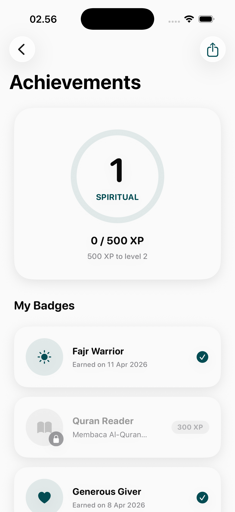
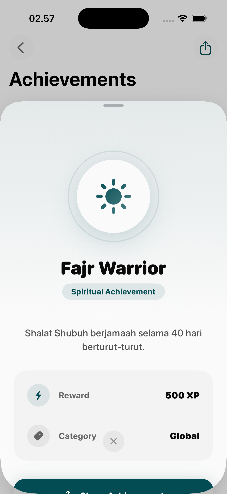
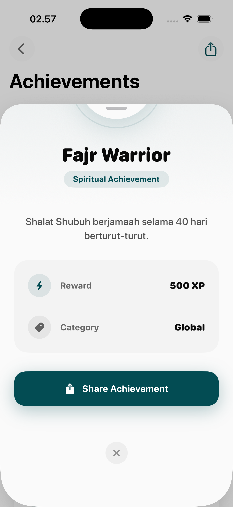
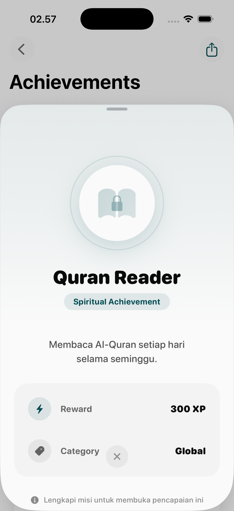
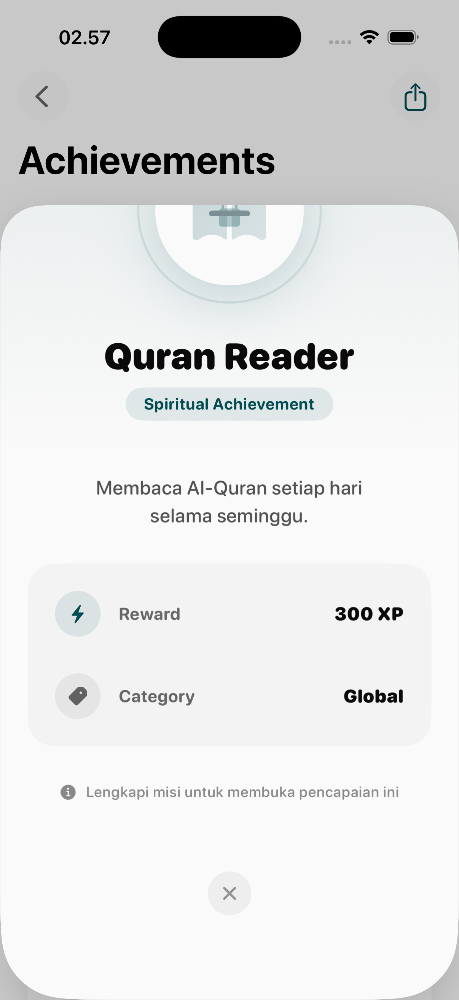
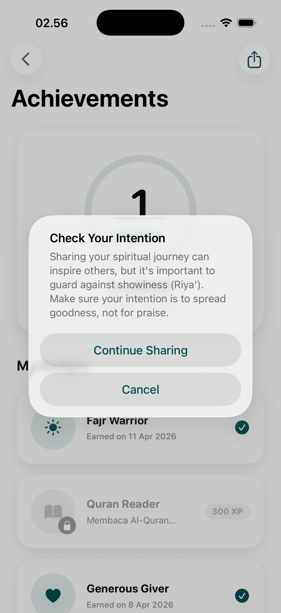

# Achievements Page

The Achievements module provides a centralized visual record of the user's successes within the Hira ecosystem. It celebrates milestones across various activities, including Quran reading, charity, and consistency.

## Interaction Flow

### 1. Achievement Dashboard
The main gallery where all possible rewards are displayed.
- **Visual Grid**: Categorized icons for different accomplishments.
- **Status Indicators**: Clear distinction between unlocked (colored) and locked (grayscale/blurred) achievements.
- **Categorization**: Groupings based on activity type (e.g., Knowledge, Generosity, Consistency).

### 2. Achievement Detail (Unlocked)
A celebratory view when an achievement is earned.
- **Badge Showcase**: High-resolution rendering of the earned icon.
- **Contextual Information**: Name of the achievement and the specific date/milestone of its accomplishment.
- **Congratulatory Messaging**: Soft, affirmative text to encourage further growth.

### 3. Locked Achievement Preview
A motivational view for goals not yet reached.
- **Criteria Reveal**: Explains precisely what the user must do to earn the achievement.
- **Incentive**: Shows a "silhouette" or locked icon to pique curiosity and drive engagement.

### 4. Social Sharing
Encouraging community growth through positive sharing.
- **Share Sheet**: Specialized interface to export achievement details to social media or messaging platforms.
- **Branded Graphics**: Visually optimized images that promote Hira while celebrating the user's progress.

## Design Psychology
- **Positive Reinforcement**: Uses visual beauty and "collectible" logic to build commitment.
- **Transparency**: Clear paths to achievement reduce frustration and provide actionable goals.