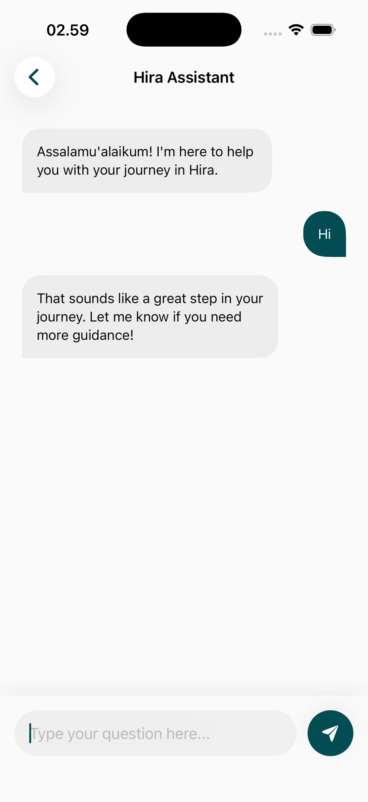

# AI Chat Page

The AI Chat module provides a 24/7 intelligent Islamic assistant designed to answer questions, provide contextual guidance, and help users navigate the vast knowledge within the Hira ecosystem.

## Core Interface Features

### 1. Unified Conversational Interface
A modern, chat-based interaction model powered by advanced AI.
- **Natural Language Interaction**: Allows users to ask questions in plain language (e.g., "How do I perform Ghusl?" or "What does the Quran say about patience?").
- **Contextual Responses**: Provides answers rooted in verified Islamic texts and scholarly sources.
- **Deep-Integration**: Ability to jump directly to specific Ayahs or Hadiths mentioned in the conversation.

## Knowledge & Safety
- **Fact-Checking**: The AI is programmed to prioritize authentic sources and provide citations where possible.
- **Dynamic Guidance**: Can assist with app navigation (e.g., "Show me the Zakat calculator").
- **Privacy Focus**: Conversations are private and designed for individual learning.