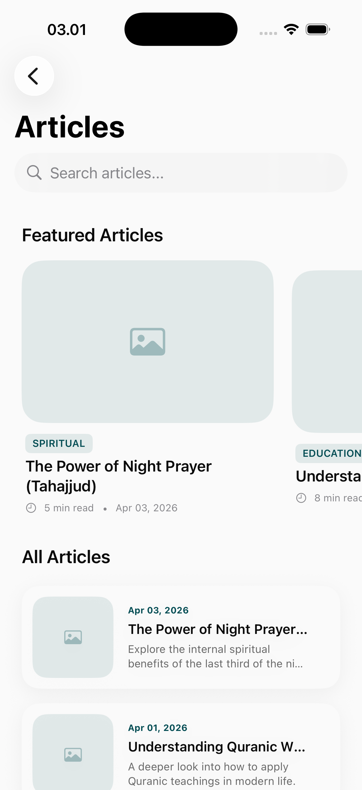
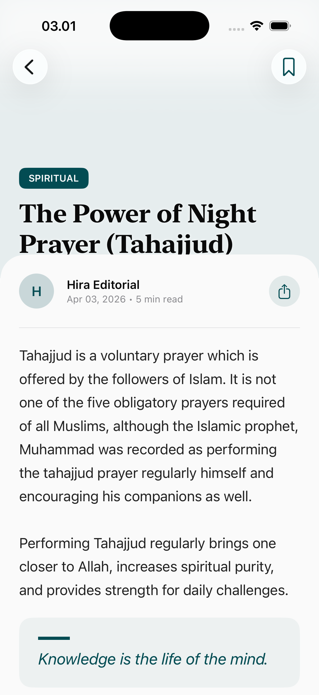

# Articles Page

The Articles module is a deep-knowledge repository featuring long-form content on Islamic history, theology, contemporary issues, and spiritual guidance.

## Interface Breakdown

### 1. Articles Library View
A clean, magazine-style layout for browsing available content.
- **Categorized Feed**: Filtering by topics such as Fiqh, Seerah, Spirituality, and Family.
- **Search & Sort**: Quickly find specific topics or sort by popularity/recency.
- **Reading Time Estimates**: Indicators to help users choose content that fits their availability.

### 2. Article Detail View
An optimized reading experience for long-form textual content.
- **Typography Focus**: Large, comfortable fonts with generous line spacing.
- **Visual Integration**: High-quality imagery that complements the written content.
- **Interactive Links**: Ability to tap on references (Ayahs/Hadiths) to view them in detail within the app.
- **Save & Share**: Tools to bookmark articles for later reading or share them with friends.

## Intellectual Integrity
- **Verified Authorship**: Content is authored or reviewed by credible scholars and writers.
- **Multilingual Support**: Key articles are available in multiple languages to support a global audience.