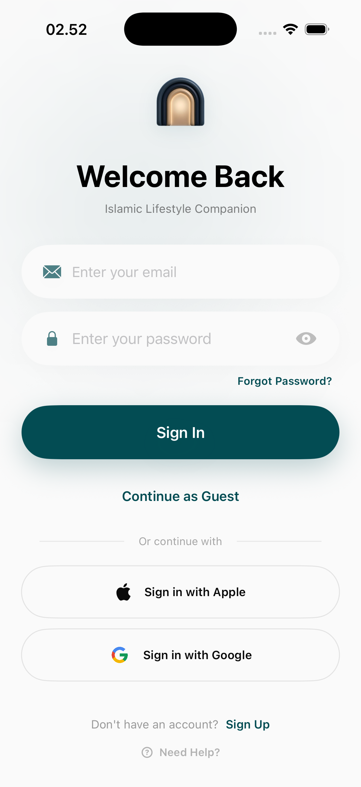
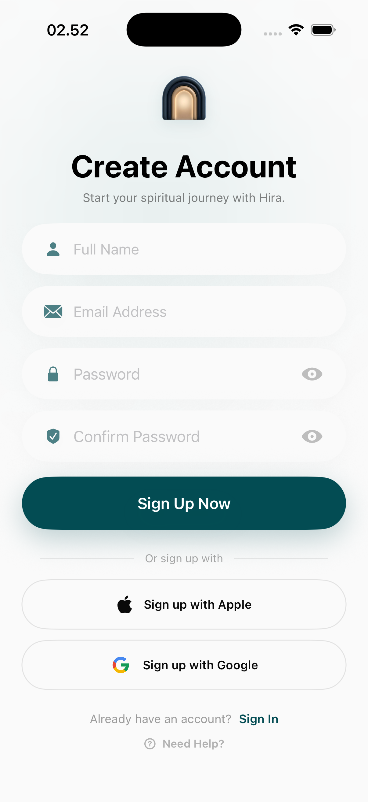
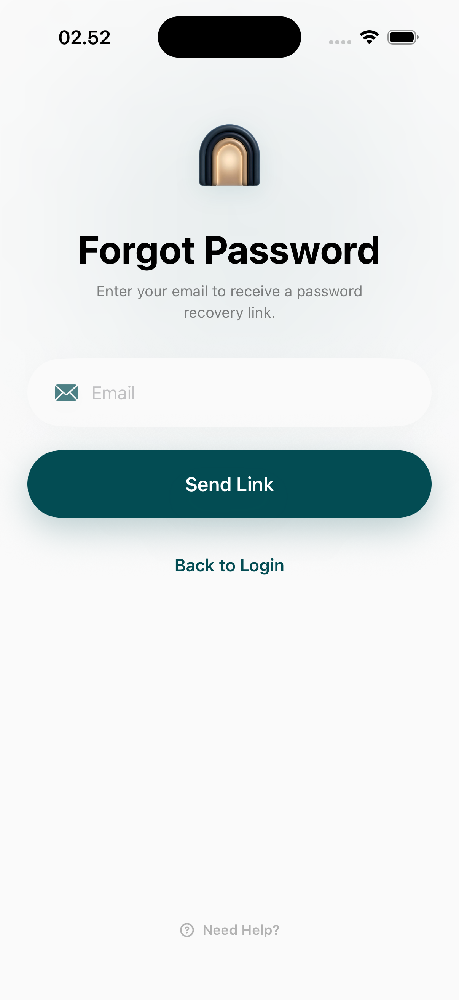

# Authentication Page

The authentication module handles user identification and security. It provides a seamless entry flow for existing users, new registrations, and a recovery mechanism for lost credentials.

## User Interfaces

### 1. Login Screen
The login interface is optimized for speed and security. It supports email/password authentication alongside social login options (Apple and Google) and a guest mode.
- **Fields**: Email and Password with visibility toggles.
- **Actions**: Login button, social login buttons, and a link to the registration flow.
- **Security**: "Forgot Password?" link is prominently placed below the password field.

### 2. Registration Screen
The registration flow captures essential user information to create a new Hira account. 
- **Fields**: Full Name, Email, and Password.
- **Agreement**: Direct links to the Terms and Privacy Policy ensure legal compliance and user informed consent.
- **Social Options**: Allows users to create an account directly using their social identities.

### 3. Forgot Password
A dedicated recovery screen for password resets.
- **Process**: Users enter their registered email to receive a reset link or verification code.
- **Simplicity**: Focuses solely on the recovery task to reduce user friction during a potentially stressful state.

## Interaction Flow
1. **Selection**: User chooses between Login or Register from the entry screen.
2. **Verification**: Inputs are validated in real-time for format correctness (e.g., email syntax).
3. **Success**: Upon successful authentication, the user is transitioned to the main Home dashboard.