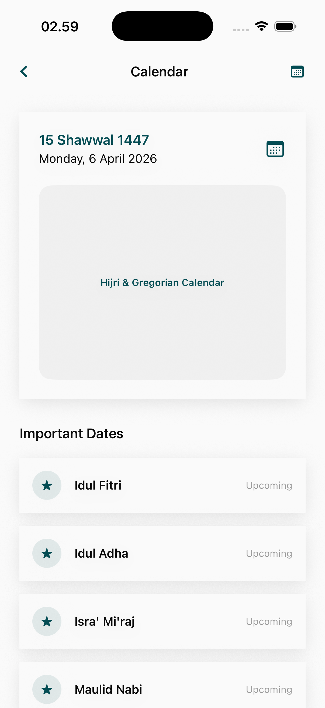

# Calendar Page

The Calendar module integrates significant Islamic dates with the user's personal tracking to provide a holistic view of holy days and religious milestones.

## Core Features

### 1. Hijri & Gregorian Overlay
A dual-calendar interface that ensures connectivity between secular and religious schedules.
- **Holy Day Highlights**: Automatic marking of significant Islamic events (e.g., Eid al-Fitr, Ashura, Laylat al-Qadr).
- **Personal Event Tracking**: Ability for users to add their own religious goals or milestones to specific dates.
- **Sun/Moon Phases**: Integrated visualization of the Islamic month progression.

## Planning & Awareness
- **Upcoming Reminders**: Notifies users of approaching holy days to allow for spiritual and logistical preparation.
- **Unified Sync**: Pulls data from the Khatam and Hijrah modules to map progress over time.