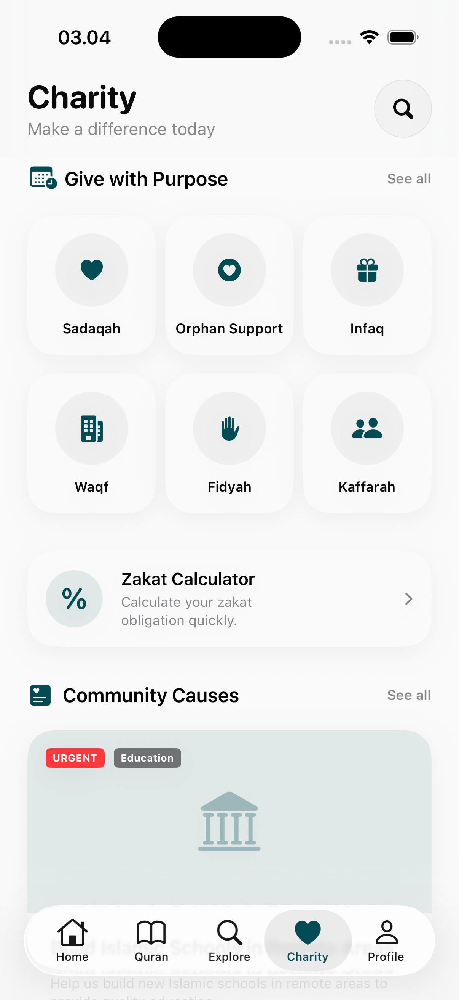
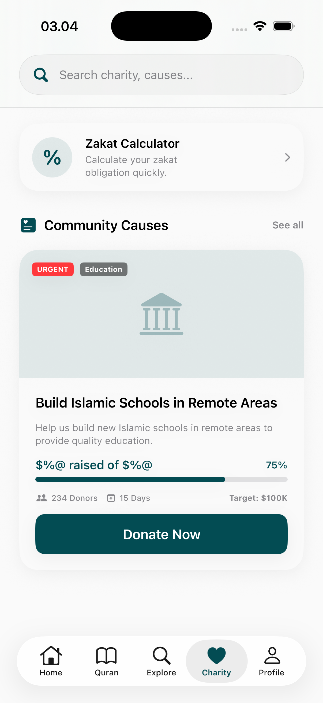
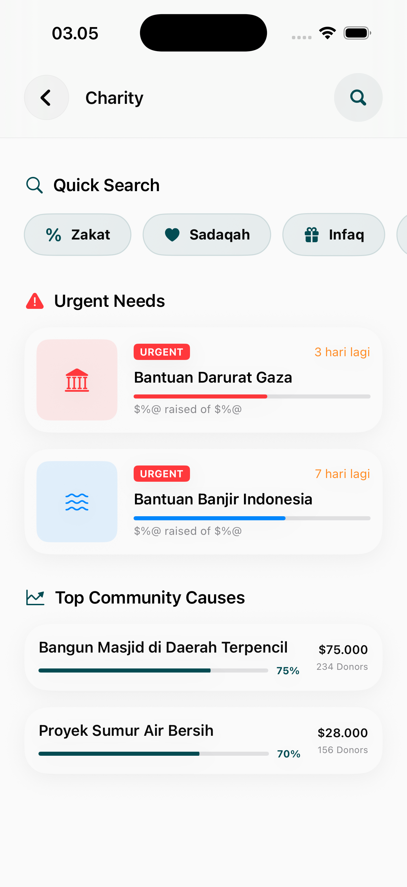

# Charity Page

The Charity module is a dedicated hub for high-impact social and religious campaigns, allowing users to discover and support causes that resonate with their values.

## Core Features

### 1. Campaign Discovery
A visually rich dashboard featuring current and urgent charity campaigns.
- **Campaign Cards**: High-level summaries including the cause, target goal, and current progress.
- **Urgent Badges**: Indicators for campaigns with high immediate needs.
- **Featured Causes**: Pinned campaigns supported by the organization.

### 2. Campaign Search & Filtering
A specialized search interface to help users find causes by theme, region, or urgency.
- **Thematic Categories**: Quickly filter by categories like Education, Healthcare, or Orphan Support.
- **Region-based Filtering**: Find campaigns supporting specific local or international communities.

## Interaction Logic
- **Progress Tracking**: Real-time visual bars showing how close a campaign is to its goal.
- **Donation History**: Linked to the user's profile for tax or personal tracking purposes.
- **Seamless Checkout**: Direct integration with payment gateways for a frictionless giving experience.