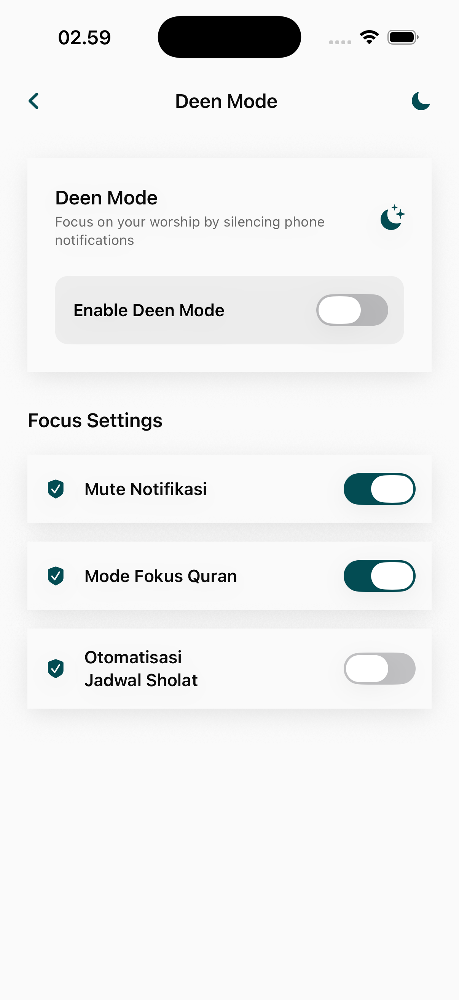

# Deen Mode Page

Deen Mode is a specialized, focused interface designed to minimize digital distractions and provide a streamlined environment for worship and contemplation.

## Core Interface Features

### 1. Focused Workflow View
A high-contrast, simplified layout focusing on essential spiritual tools.
- **Distraction-Free Dashboard**: Removes complex widgets and tertiary features to prioritize Quran reading, Dhikr, or Prayer.
- **Service Specialization**: Provides quick, large-button access to the most critical "ritual" features.
- **Atmospheric UI**: Often utilizes unique, calming themes optimized for focus and tranquility.

## Functional Intent
- **Digital Mindfulness**: Encourages users to disconnect from social notifications and noise while engaging with the app.
- **One-Tap Activation**: Intended for use during designated spiritual times (e.g., Tahajjud, Friday prayer, or personal study sessions).