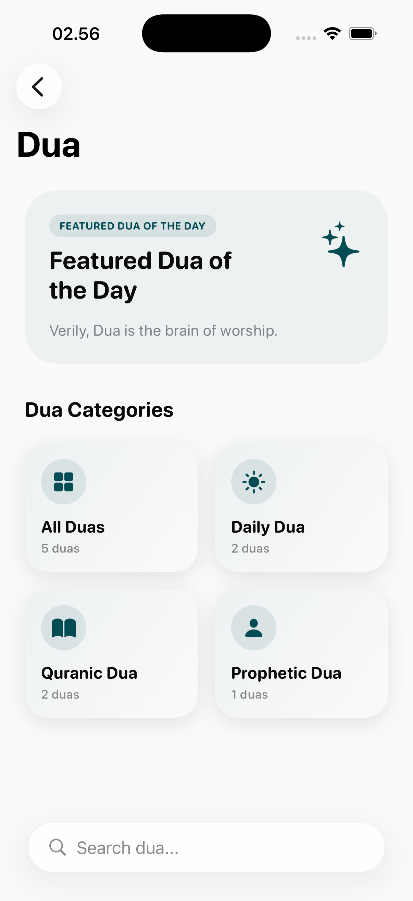
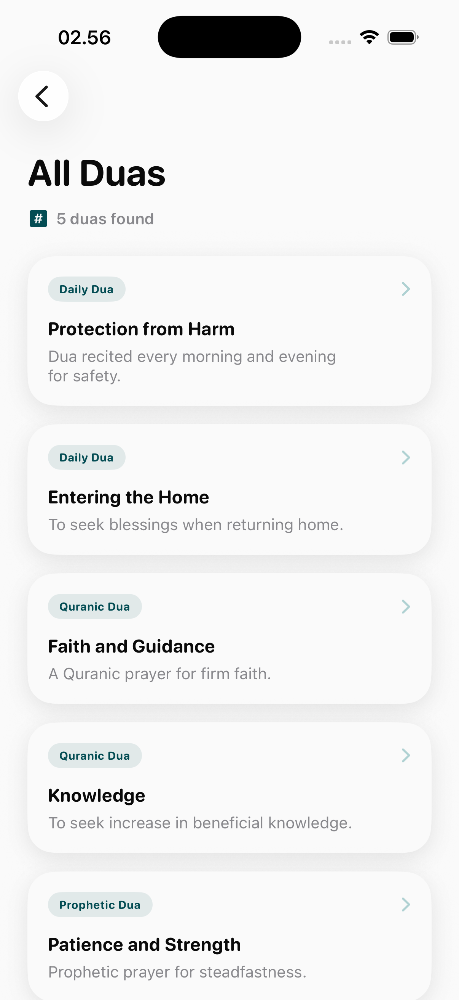
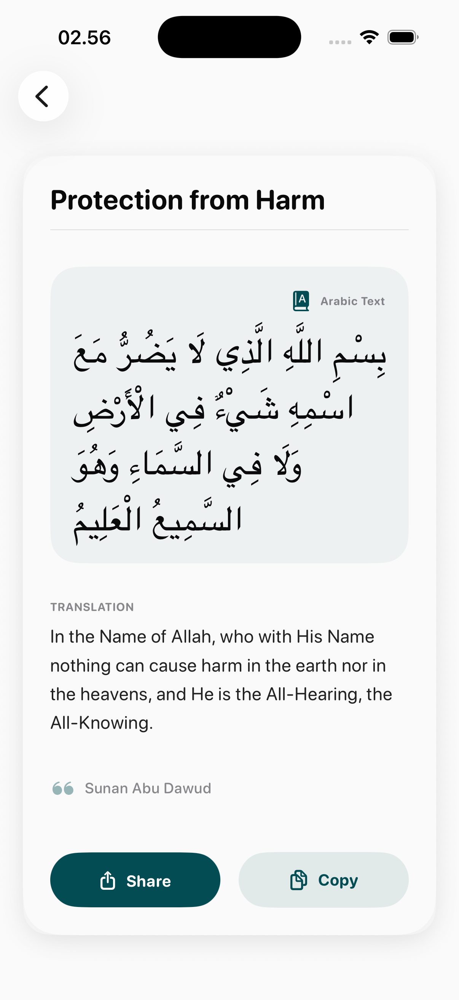

# Dua Page

The Dua module serves as a comprehensive spiritual companion, organizing supplications for every occasion in a user's life.

## Interface breakdown

### 1. Dua Categories Overlay
A thematic entry point that allows users to find supplications based on their current needs.
- **Icon-Driven Categories**: Visual navigation for common scenarios (e.g., Morning/Evening, Travel, Family, Hardship).
- **Global Search**: Quickly find specific Duas by keyword or theme.

### 2. Category List View
Once a category is selected, the user is presented with a curated list of relevant supplications.
- **Brief Previews**: Display of the Dua title and a short snippet.
- **Quick Reference**: Navigation designed for fast access during daily routines.

### 3. Dua Detail View
The primary focus mode for reciting and contemplating the supplication.
- **Visual Presentation**: Clear, large Arabic script optimized for readability.
- **Enhanced Content**: Includes phonetic transliterations and detailed translations.
- **Functional Tools**: Integrated audio recitation (where available) and easy sharing options to spread spiritual benefits.

## Design Focus
- **Simplicity**: Minimized clutter to maintain focus during prayer.
- **Contextual Relevance**: Organized to make finding the "right Dua for the moment" as effortless as possible.