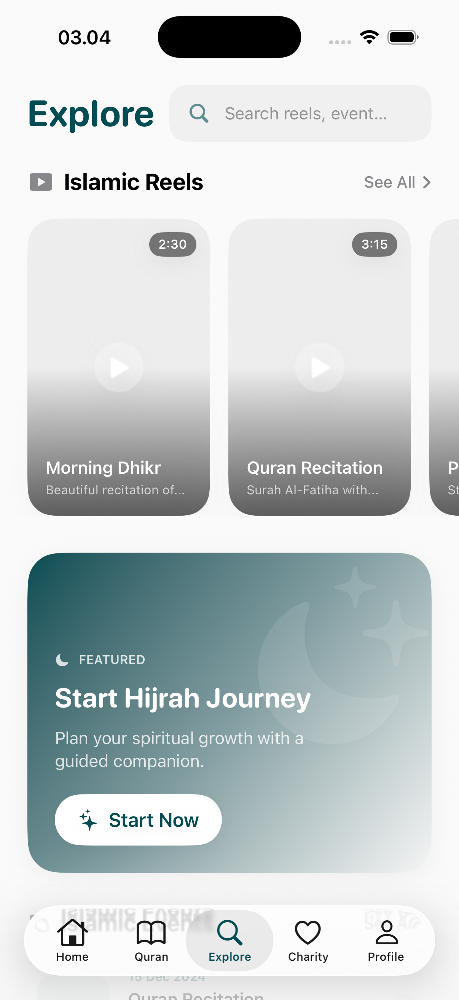
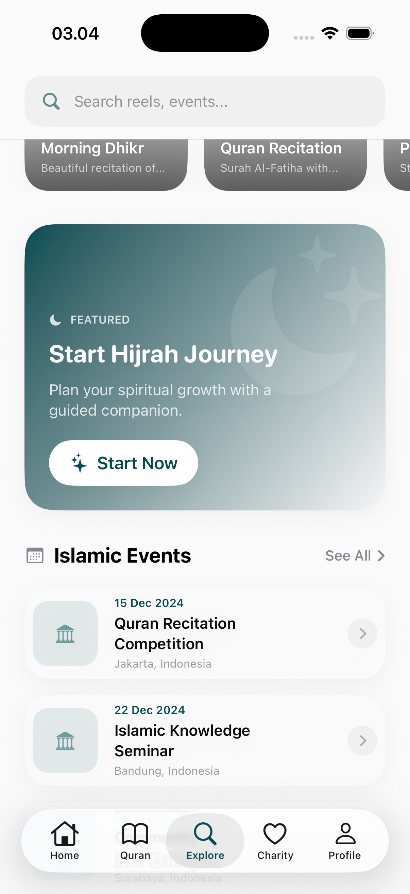
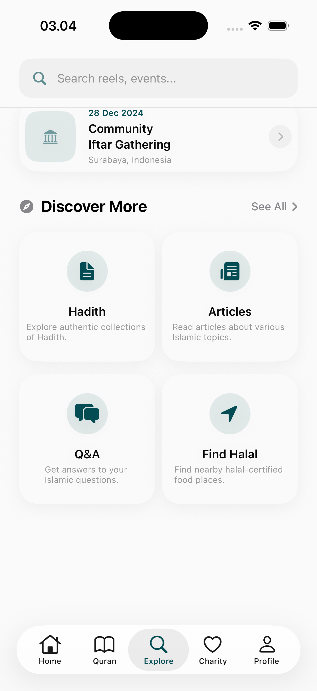
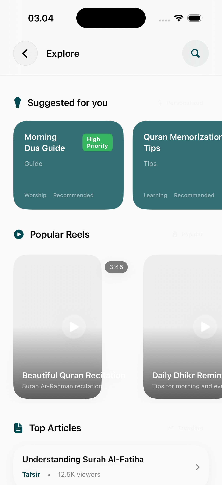

# Explore Page

The Explore module is the application's discovery hub, highlighting new content, community initiatives, and personalized recommendations beyond the core rituals.

## Core Discovery Features

### 1. Curated Content Dashboard
A dynamic feed featuring high-quality spiritual media.
- **Featured Articles & Media**: Visual cards for the latest Islamic articles, videos, or news.
- **Community Highlights**: Showcases of trending campaigns or community achievements.
- **Interest-Driven Sections**: Content grouped by areas such as History, Science in Islam, and Spiritual Growth.

### 2. Specialized Discovery Search
An advanced search interface tailored for information gathering.
- **Predictive Results**: Real-time suggestions as the user types.
- **Resource Categorization**: Clearly separates results between Articles, Videos, and Feature Shortcuts.

## Research & Contemplation
- **Knowledge Depth**: Positions Hira as an educational resource as much as a ritual companion.
- **Engagement**: Uses high-impact photography and storytelling to draw users into deeper study.