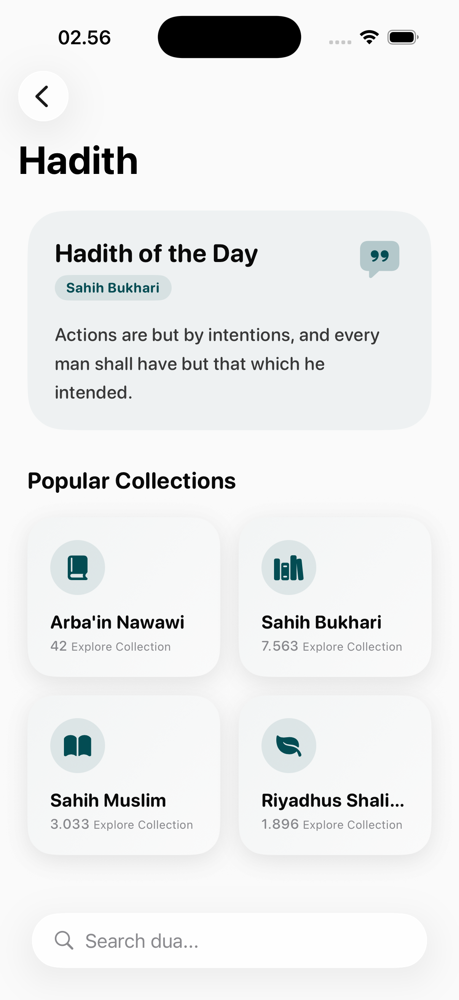
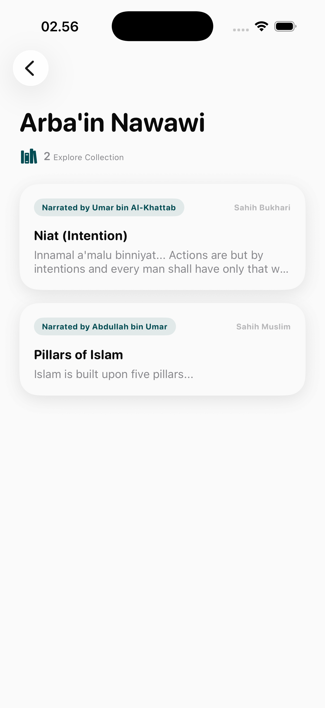
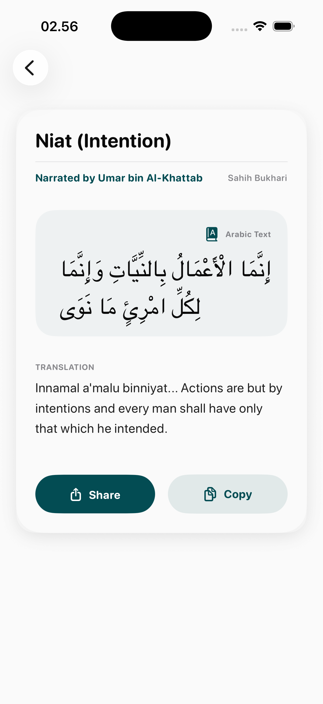

# Hadith Page

The Hadith module provides a verified repository of the sayings and actions of the Prophet Muhammad (PBUH), organized for easy study and reference.

## User Interfaces

### 1. Hadith Collection Dashboard
The entry point displays categorized collections from renowned scholars (e.g., Bukhari, Muslim).
- **Collection Cards**: Summaries of each collection with the total number of Hadiths.
- **Search**: Integrated search to find specific topics or narrators across all collections.

### 2. Hadith List View
Navigation within a specific collection, often organized by chapters or books.
- **Categorization**: Grouping by thematic books (e.g., Book of Faith, Book of Knowledge).
- **Navigation**: Clean vertical scrolling through numbered Hadiths.

### 3. Hadith Detail View
The dedicated view for reading and sharing a specific Hadith.
- **Arabic Text**: Clear Display of the original text.
- **Translation**: Accurate translations provided below the Arabic text.
- **Metadata**: Display of the grade (e.g., Sahih, Hasan) and the chain of narrators (Isnad) where applicable.
- **Actions**: One-tap sharing and bookmarking capabilities.

## Research & Verification
- **Primary Sources**: Data is sourced from authentic Hadith databases.
- **Academic Focus**: Hira prioritizes authenticity and provides scholarly grading to guide the user.