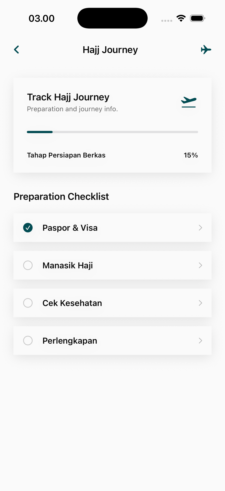

# Hajj Journey Page

The Hajj Journey module provides a comprehensive, step-by-step guide and tracking system for one of the most significant spiritual experiences in a Muslim's life.

## Core Interface Features

### 1. Journey Roadmap
A visual timeline or checklist of the Hajj rituals and milestones.
- **Ritual Tracking**: Step-by-step guidance through the essential acts of Hajj (e.g., Ihram, Tawaf, Sa'i, Arafat, Muzdalifah, Mina).
- **Current Status Display**: Highlights the user's current ritual and provides preparation for the next.
- **Location Context**: Information on key geographical locations associated with each step.

## Educational & Spiritual Content
- **Rulings & Adab**: Each step is accompanied by its respective Fiqh rulings and recommended spiritual intentions (Niyyah).
- **Preparation Checklists**: Guidance on what to pack and how to prepare mentally and physically for each phase of the pilgrimage.