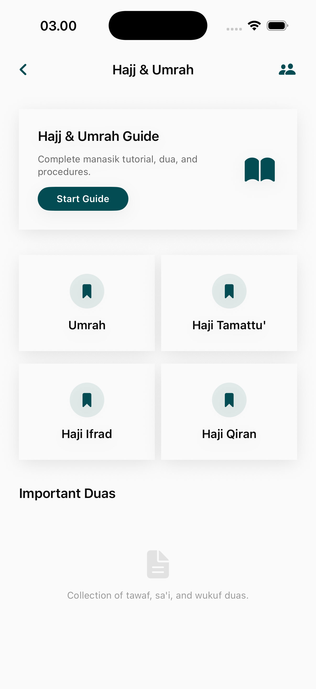

# Hajj & Umrah Page

The Hajj & Umrah module serves as a primary portal for pilgrimage-related information, logistics, and ritual guidance for both the minor (Umrah) and major (Hajj) pilgrimages.

## Core Interface Features

### 1. Pilgrimage Selection & Dashboard
A centralized hub to select and manage the user's pilgrimage experience.
- **Service Shortcuts**: Quick links to Hajj guides, Umrah guides, and specialized resources.
- **Featured Packages or Content**: Curated information relevant to the current pilgrimage season.
- **Ritual Overview**: High-level summaries of the core differences and requirements for both Hajj and Umrah.

## Educational Content
- **Step-by-Step Interactive Guides**: Visual and text-based instructions for every ritual.
- **Supplication Library**: Specialized Duas and Dhikr specific to the Hajj and Umrah experience.
- **Preparation Module**: Checklists for logistics, health requirements, and spiritual preparation.