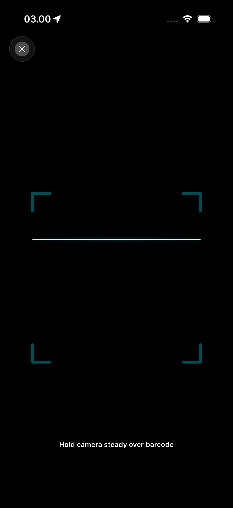
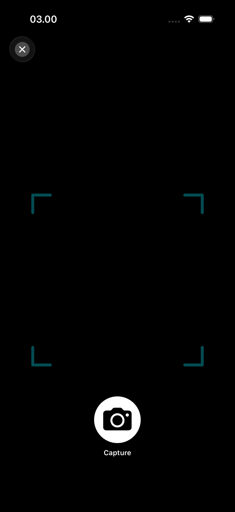
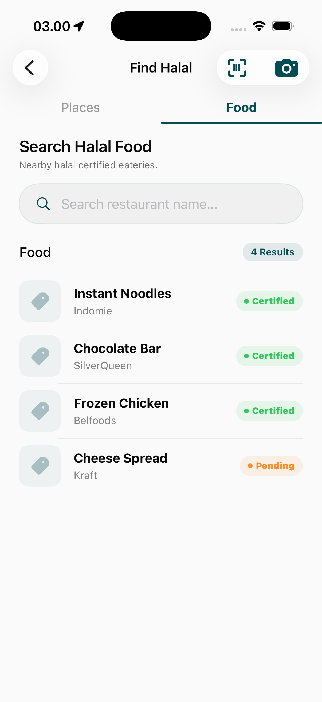
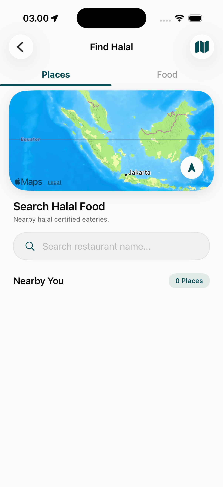

# Halal Scanner & Places Page

The Halal module provides essential tools for users to verify the Halal status of food products and discover certified dining establishments.

## Discovery & Verification Tools

### 1. Halal Scanning (Barcode)
A specialized AR-compatible interface for real-time product verification.
- **Dynamic Viewfinder**: A high-speed barcode scanner that identifies products.
- **Verification Logic**: Cross-references barcodes with global Halal databases to provide safe/doubtful/forbidden status.

### 2. Product Information
Detailed breakdowns of scanned or searched food products.
- **Halal Status Badge**: Clear, color-coded indicators (Green for Halal, Red for Haram).
- **Ingredient Breakdown**: Analysis of potentially doubtful ingredients (Mashbooh).

### 3. Halal Places Discovery
A localized search tool for finding Halal-certified or Muslim-friendly dining.
- **Distance-Sorted List**: Highlights restaurants, cafes, and markets near the user's location.
- **Certification Badges**: Displays the specific Halal authority that certified the establishment.

## Functional Value
- **Doubt Management**: Helps users navigate complex global food markets with confidence.
- **Travel Companion**: Essential tool for Muslims traveling to regions where Halal transparency is low.