# Hijrah Page

The Hijrah module is a gamified spiritual growth system designed to guide users through progressive "missions" and "levels" of religious practice. It provides a structured path for personal development, offering rewards and tracking for consistent commitment.

## Progression Interface

### 1. Dashboard & Leveling
The central command center for the user's Hijrah journey.
- **Level Progress**: Large, circular progress indicators showing current level and experience points (XP).
- **Mission Tiers**: Progressing from "Pemula" (Beginner) to more advanced stages.
- **Personalized Greeting**: Dynamic motivation based on the user's progress.
- **Goal Overview**: High-level summary of the day's spiritual objectives.

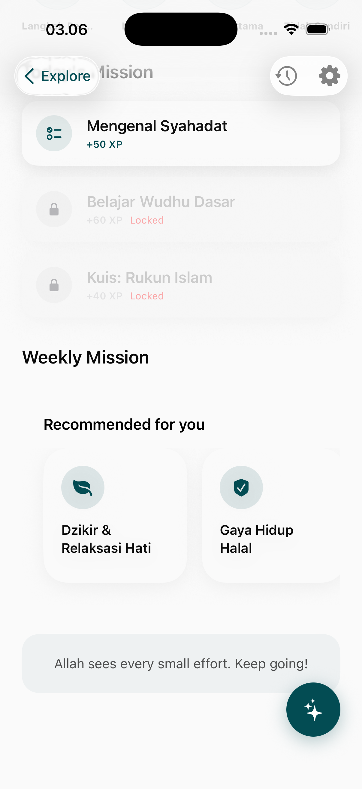
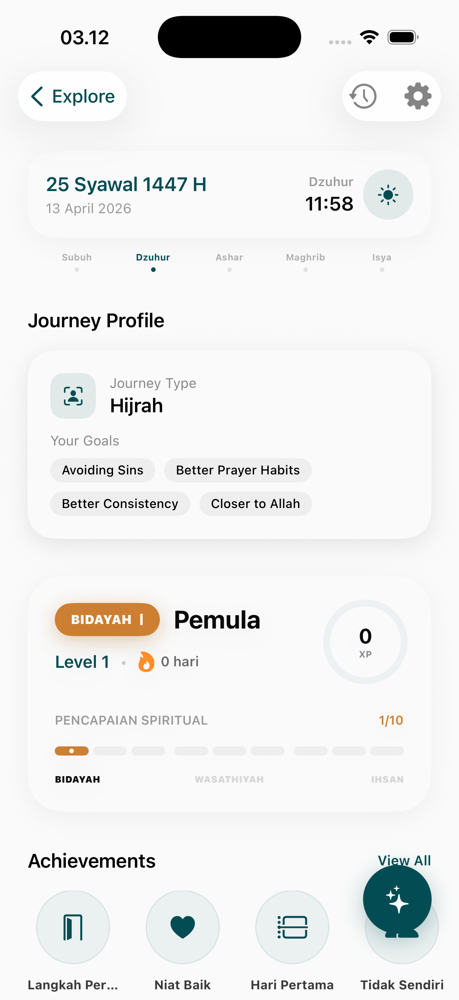

### 2. Guided Development (Steps)
A sequential roadmap for newcomers or those starting a fresh habit.
- **Step-by-Step Flow**: Logical progression through the fundamentals of faith and practice.
- **Interaction Sheets**: Educational content delivered in bite-sized chunks for each step.
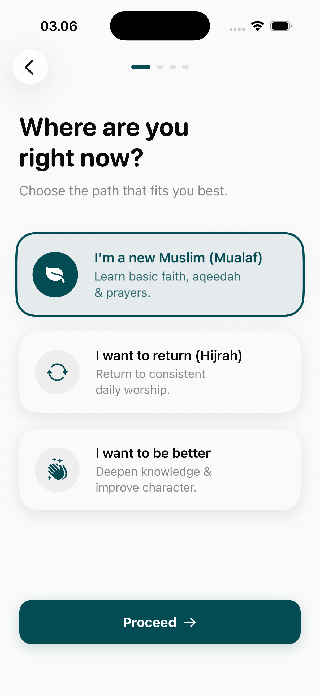
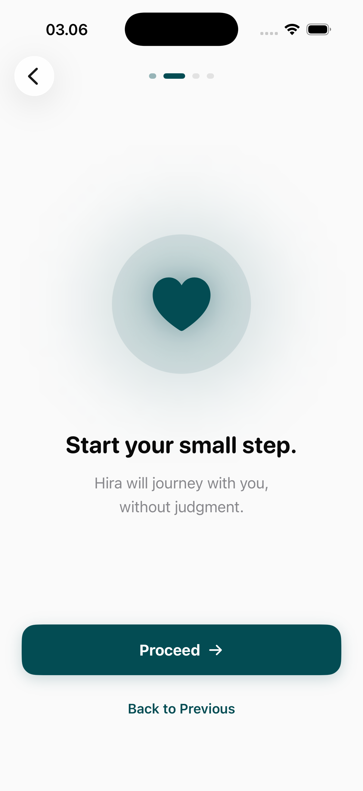
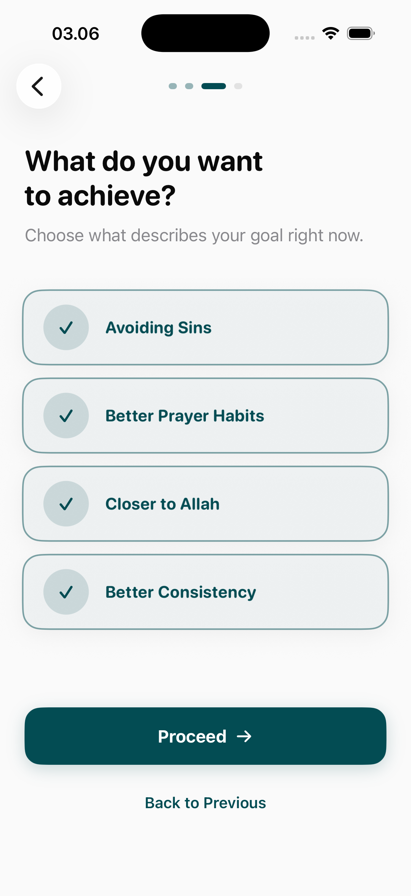
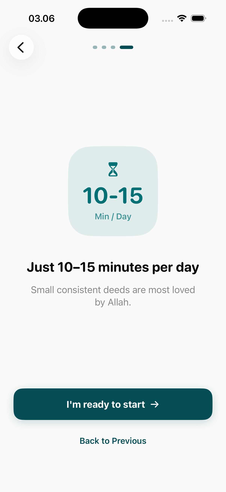

## Mission & Habit Building

### 1. Active Missions
Specific tasks designed to build religious knowledge and habits.
- **Multimedia Learning**: Missions that include video content and detailed knowledge bases.
- **Gamified Elements**: Missions involving timers, quizzes, and specific tool integration (e.g., performing Tasbih as part of a mission).
- **Progress Tracking**: Real-time timers and mission-specific history logs.
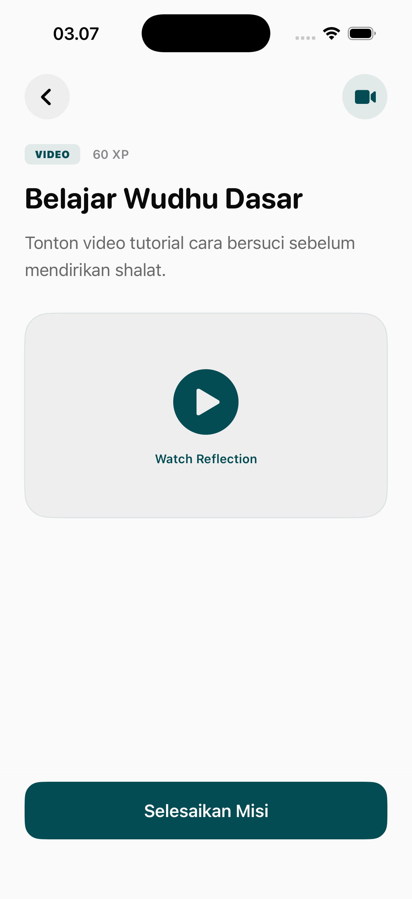
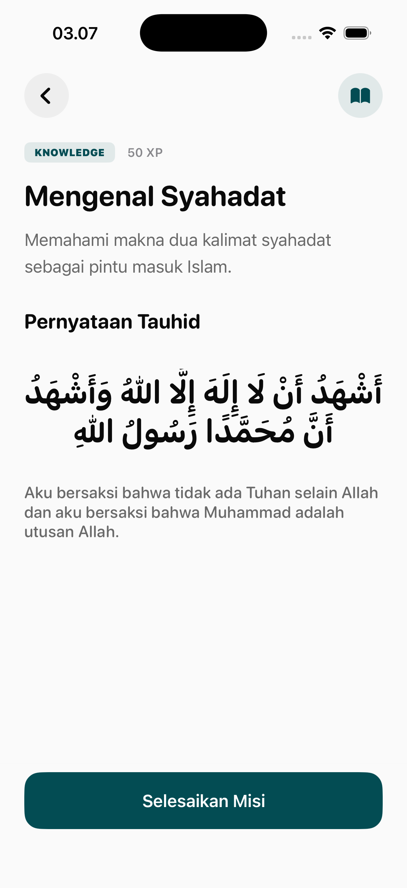
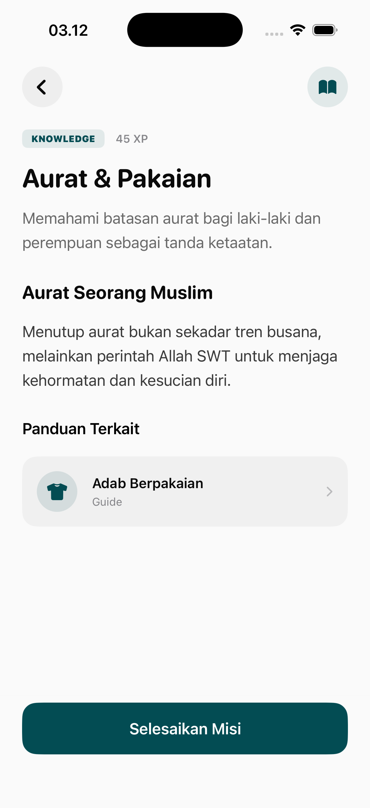
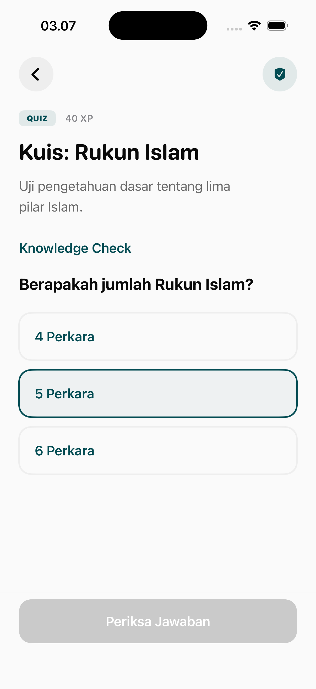
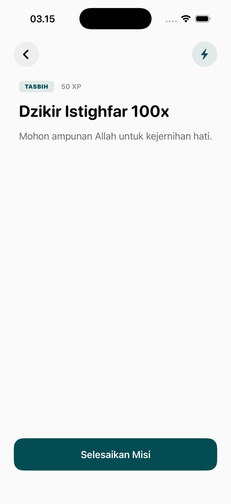
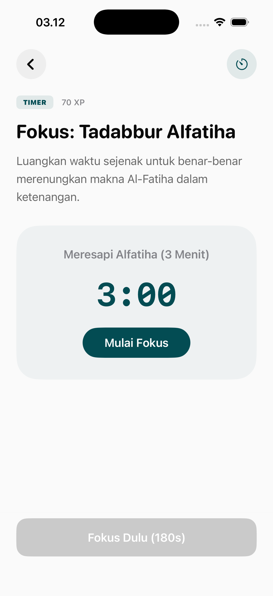
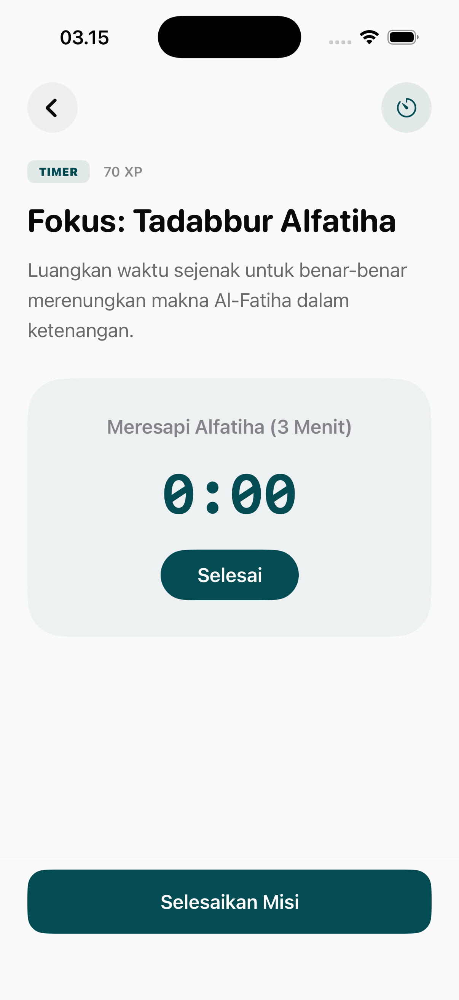

### 2. Feedback & Success
The app uses positive reinforcement to encourage consistency.
- **Celebration Popups**: High-impact visual confirmation when a mission is completed successfully.
- **Success States**: Specialized UI transitions reflecting mission accomplishment.
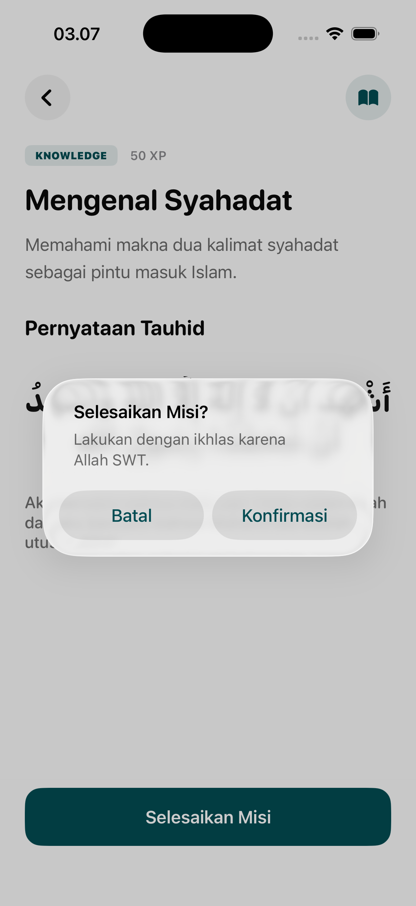
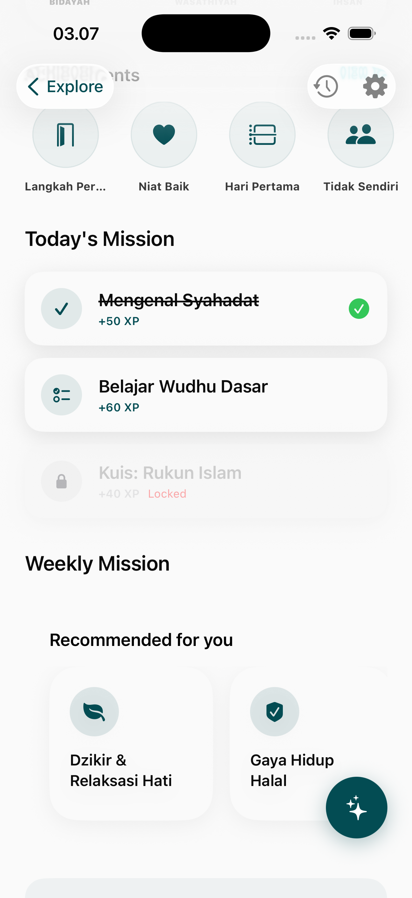

## Personalization & Rewards

### 1. Achievements & Badges
A dedicated area for visual rewards earned through the Hijrah journey.
- **Achievement Gallery**: A list of earned and locked badges representing various spiritual milestones.
- **Badge Details**: Deep-dive into specific achievements, including criteria and date earned.
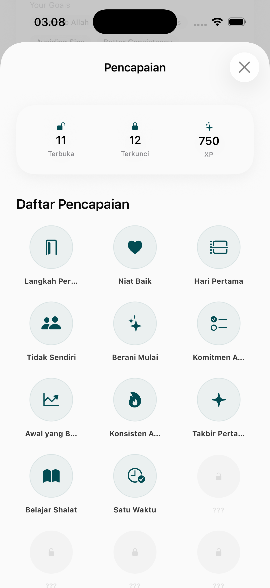
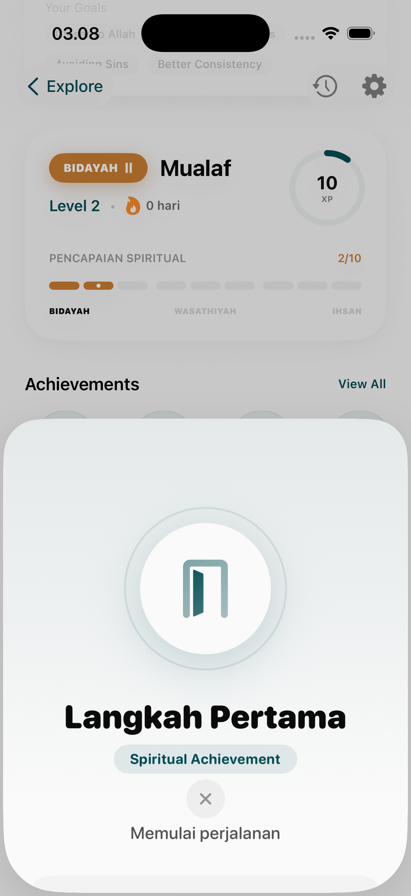
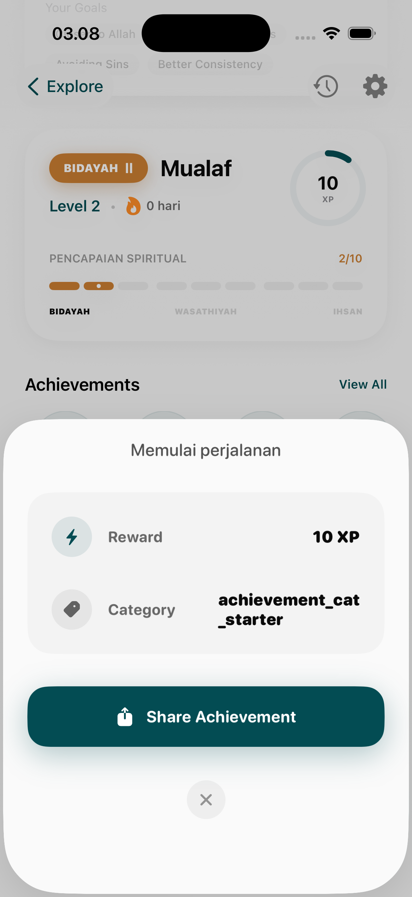

### 2. Management & Preferences
- **Mission Editing**: Ability to customize or re-select focal missions.
- **Reset Functionality**: Safe-guards and confirmation popups for users who wish to restart their journey or specific tiers.
- **Smart Recommendations**: Algorithm-driven suggestions based on current performance and level.
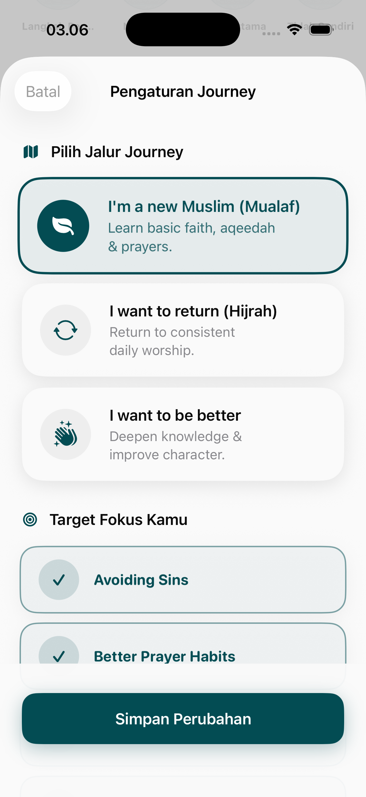
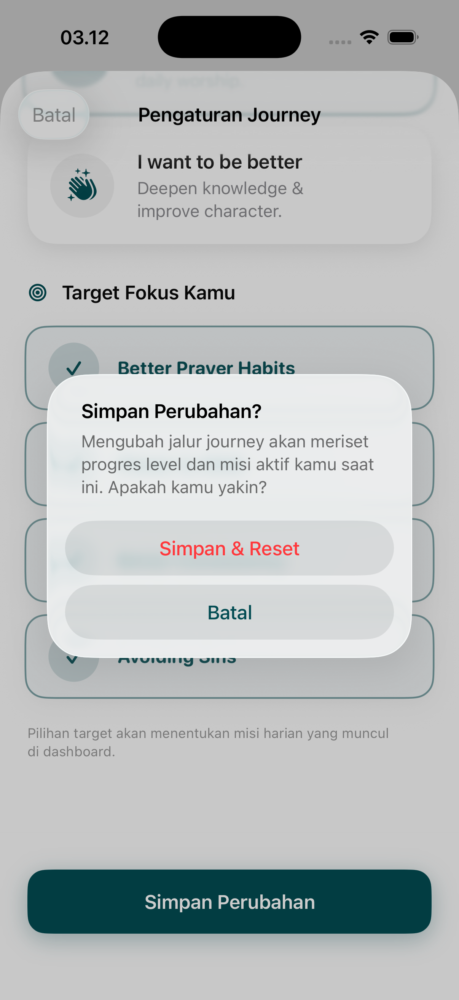
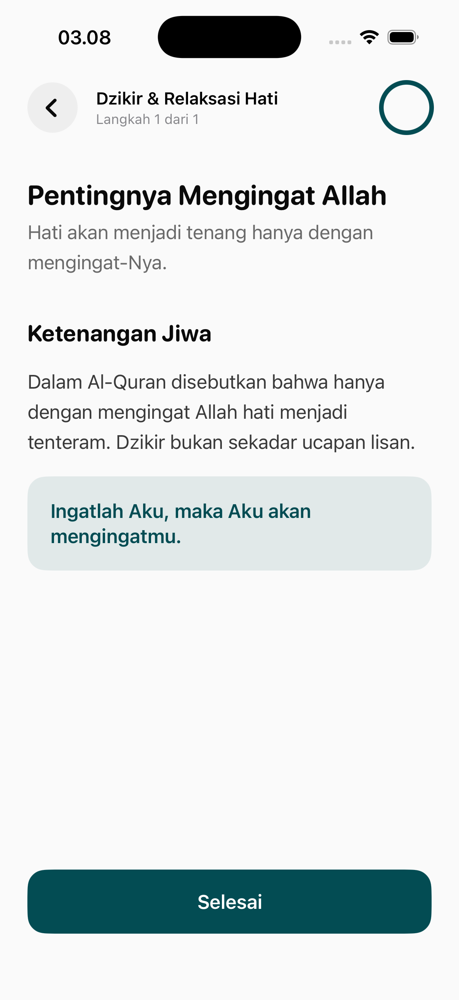

## Design & Psychology
- **Gamification**: Uses XP, levels, and badges to simulate a role-playing game (RPG) progression.
- **Micro-tasks**: Breaking deep spiritual concepts into simple, repeatable "missions."
- **Visual Feedback**: High use of icons, progress bars, and high-quality celebratory graphics.