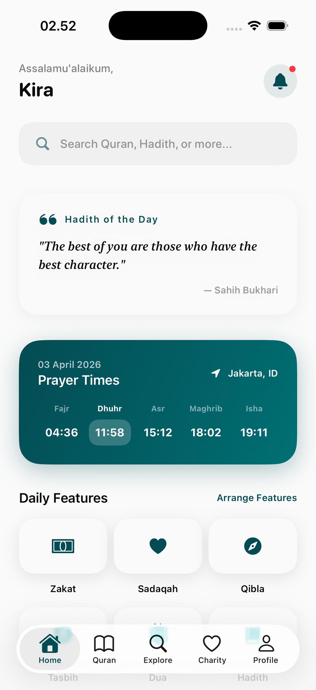
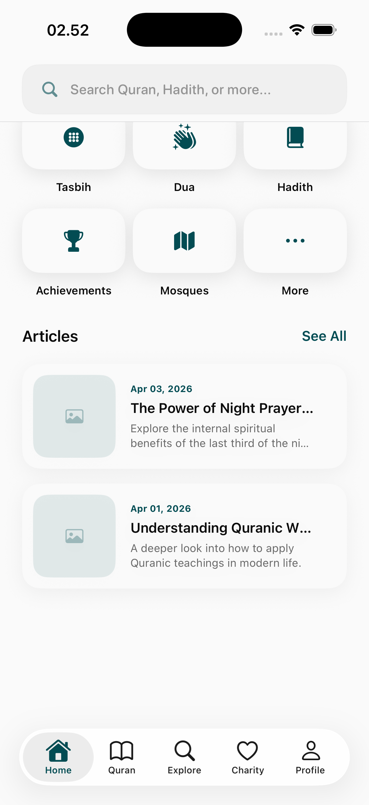
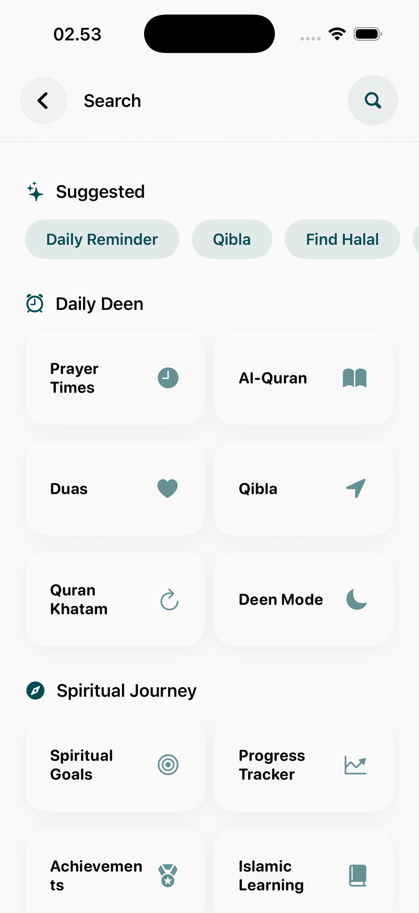
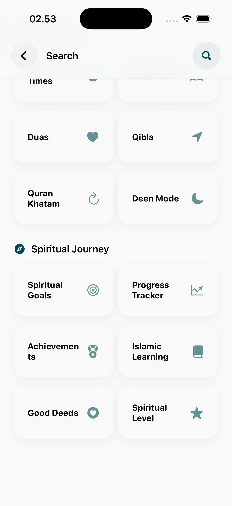
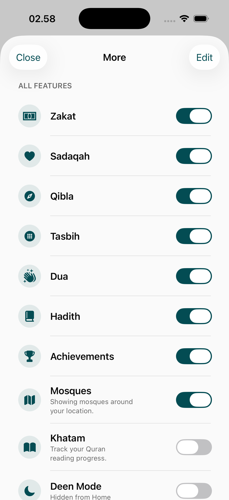
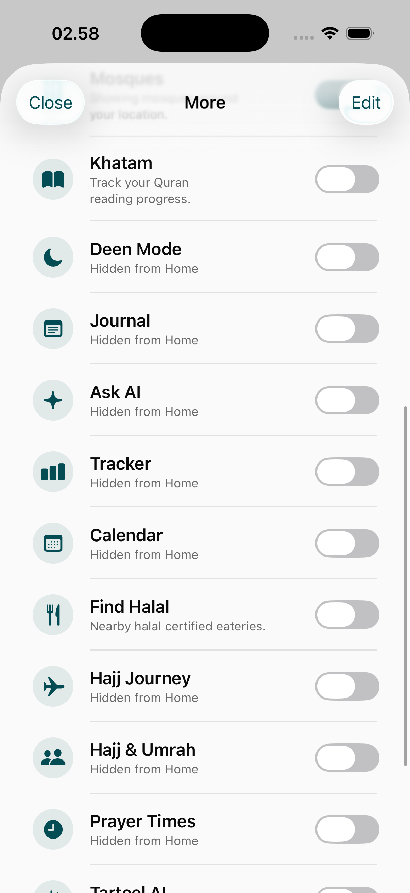
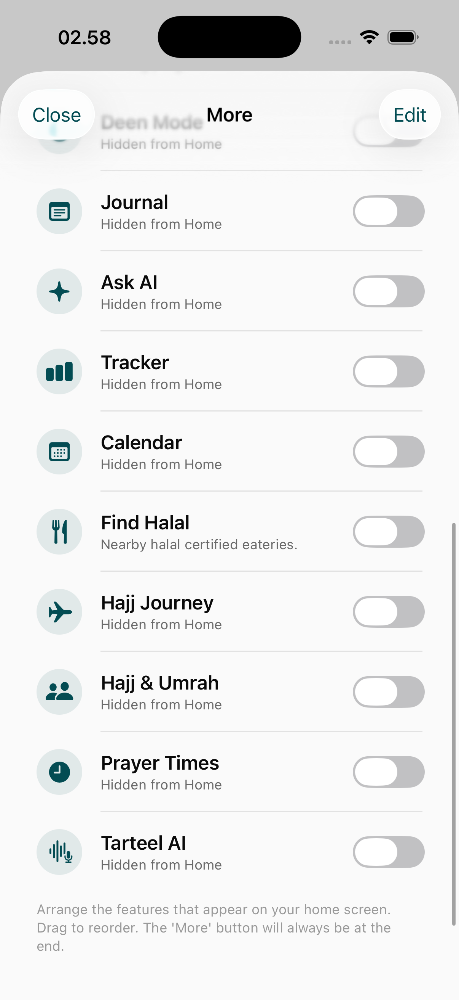
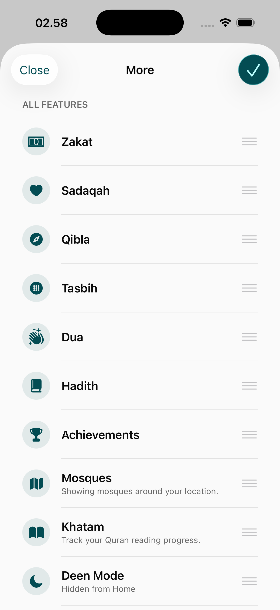

# Home Dashboard Page

The Home Dashboard is the central hub of the Hira application, providing quick access to essential Islamic tools, personalized content, and real-time religious information.

## Primary Views

### 1. Main Dashboard
The core interface features a comprehensive overview of the user's spiritual status.
- **Prayer Times Card**: Real-time ticker for the current and next prayer times based on location.
- **Featured Quote/Ayah**: Rotating daily inspiration.
- **Service Shortcuts**: Grid of core features (Quran, Hadith, Qibla, etc.).
- **Reading Progress**: Indicators for the last read Ayah or current Khatam status.

### 2. Global Search
A powerful search interface that indexes the entire Hira ecosystem.
- **Interface**: A clean overlay with a search bar and categorized results.
- **Recent Searches**: List of the user's latest queries for quick retrieval.
- **Contextual Results**: Results are grouped by type (e.g., Quranic Ayahs, Hadith, Articles).

### 3. Feature Selection & Customization (More)
When the user wants to explore beyond the primary shortcuts, the "More" screen provides a full catalog of Hira's capabilities.
- **Categorized Services**: Features are grouped logically (e.g., Rituals, Progress, Knowledge).
- **Edit Mode**: Users can customize their main dashboard grid by selecting their most-used features. This ensures a personalized experience catering to individual spiritual priorities.

## User Experience Design
- **Visual Hierarchy**: Real-time prayer information is pinned at the top for maximum visibility.
- **Customization**: The "Edit Features" mode allows users to rearrange their dashboard, promoting user empowerment.
- **Consistency**: High-quality icons and unified typography maintain brand integrity across all dashboard widgets.