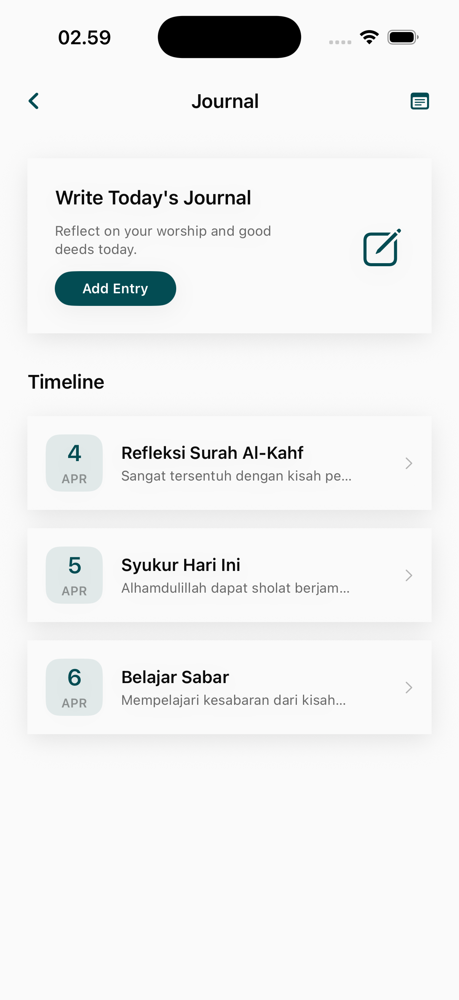

# Journal Page

The Journal module provides a private, contemplative space for users to record their spiritual reflections, gratitude, and personal growth milestones.

## Core Features

### 1. Spiritual Reflection Workspace
A clean, distraction-free interface for writing and reviewing personal notes.
- **Entry List**: Chronological view of past reflections.
- **Rich Content Support**: Ability to link reflections to specific Ayahs or Hadiths found within the app (where applicable).
- **Mood/Spiritual Tonalities**: Optional tags to categorize entries based on the user's current spiritual state (e.g., Grateful, Seeking Strength, Reflective).

## Design Focus
- **Privacy First**: Designed as a personal, non-social space to encourage honest self-reflection.
- **Simplicity**: Focuses on the "Act of Writing" with minimal UI interruptions.