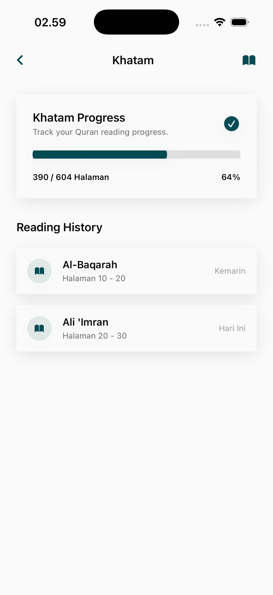

# Khatam Page

The Khatam module is a specialized tracker for users aiming to complete the entire Quran from start to finish. It provides goal-based scheduling and visualization of reading progress.

## Core Features

### 1. Progressive Tracking
A visually intuitive dashboard for the Khatam journey.
- **Reading Progress Bar**: Global percentage of the Quran completed.
- **Timeline Estimation**: Based on current reading habits, the app predicts the completion date.
- **Scheduled Reminders**: Ability to set daily targets (e.g., number of pages or ayahs per day) to reach the goal by a specific date.

## Personalization
- **Flexible Goals**: Users can define their own Khatam duration (e.g., 30 days, 60 days, 1 year).
- **History Log**: Tracking of previous Khatam completions to celebrate consistency over time.