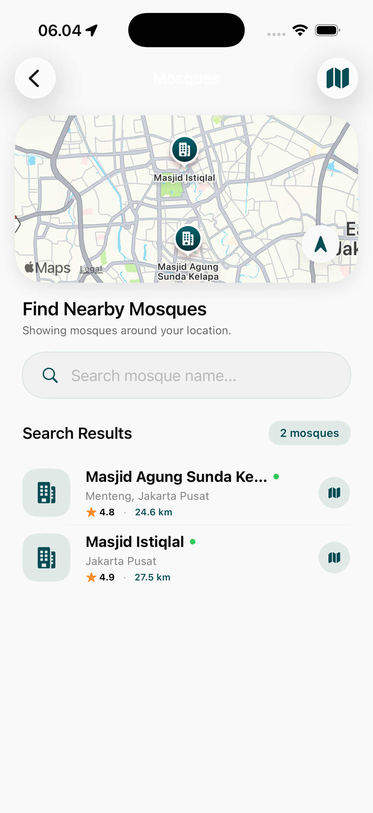
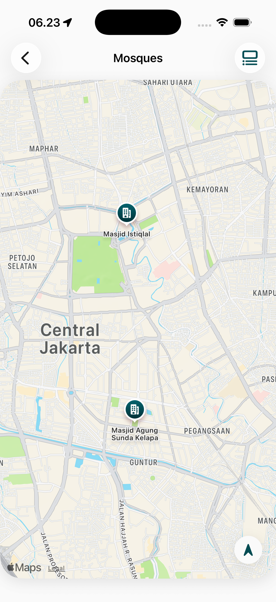
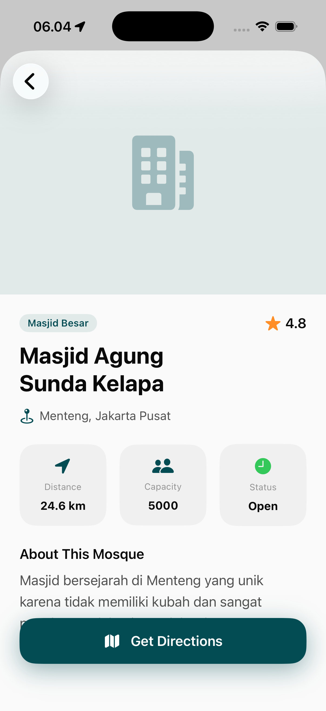

# Mosques Page

The Mosques module helps users find nearby places of worship and provides essential information about their facilities and services.

## Core Features

### 1. Mosque Discovery & Map
A localized interface for finding the nearest mosques.
- **Geographic Search**: Uses the device's GPS to plot nearby mosques on a map.
- **Distance-Sorted List**: A list view showing mosques ordered by proximity.
- **Quick Navigation**: Integration with external map providers (Google Maps, Apple Maps) for turn-by-turn directions.
<table>
  <tr>
    <td></td>
    <td></td>
  </tr>
</table>

### 2. Mosque Detailed Information
In-depth data to help users choose a place of worship that meets their specific needs.
- **Facility Indicators**: Icons showing availability of Wudu areas, female-only spaces, and accessibility features.
- **Service Schedule**: Information on Jummah prayer timings and other specialized services (e.g., classes, counseling).
- **Community Ratings/Photos**: User-contributed content to provide real-world context.

## Functional Utility
- **Real-Time Availability**: Updates on current status (open/closed) based on prayer timings.
- **Filtering**: Ability to find mosques with specific features (e.g., "Parking Available", "Halal Food Nearby").