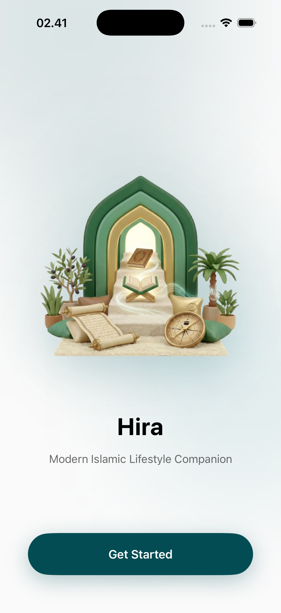
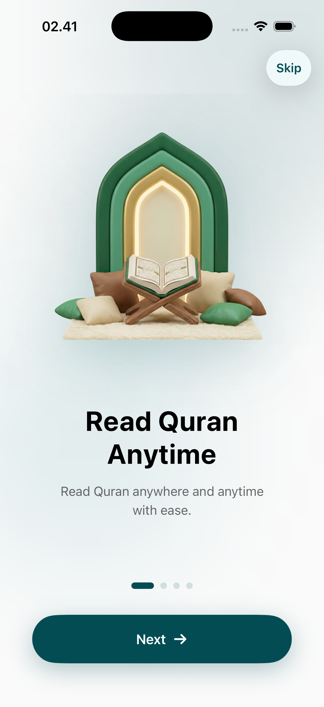
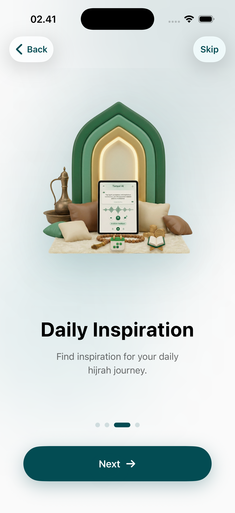
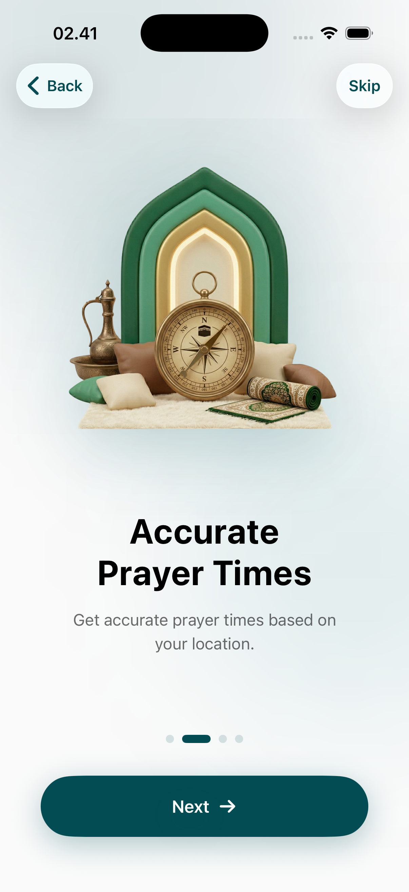
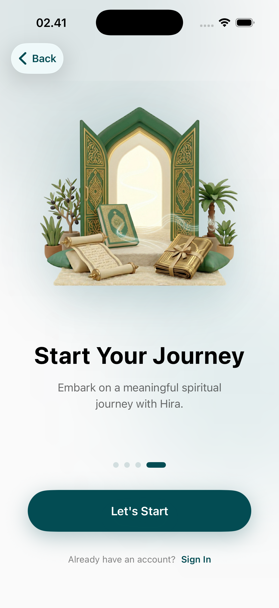

# Onboarding Page

The onboarding flow is designed to introduce users to the core value propositions of the Hira application. It follows a clean, modern design language with high-quality illustrations and clear call-to-action (CTA) buttons.

## Flow Overview

### 1. Landing Screen
The journey begins with a welcoming interface that sets the tone for the spiritual experience. It introduces the Hira brand and provides the initial entry point for new users.

### 2. Quran Centricity
Hira emphasizes its deep Quranic features early in the flow. This screen highlights the digital Mushaf, translation capabilities, and the accessibility of Allah's words at the user's fingertips.

### 3. Daily Inspiration
The app positions itself as a companion for daily spiritual growth. This section focuses on features like daily ayahs, hadiths, and inspirational content designed to keep the user engaged with their faith throughout the day.

### 4. Prayer Discipline
Accurate prayer times and reminders are critical components of the app. This screen introduces the prayer tracking and timing features, ensuring users never miss their daily obligations.

### 5. Final Step
The onboarding concludes with a final confirmation and a call to begin the journey. This transition ensures the user is prepared to enter the main application dashboard with a clear understanding of what Hira offers.

## Design Details
- **Typography**: Large, bold headings for clarity.
- **Imagery**: Soft, curated illustrations that evoke a sense of peace.
- **Progress Indicators**: Subtle indicators at the bottom to show the user's journey through the onboarding steps.