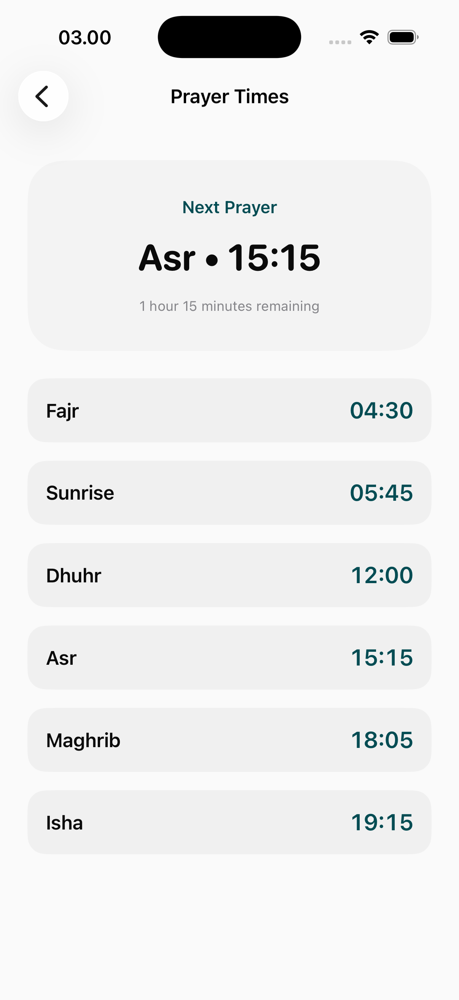

# Prayer Times Page

The Prayer Times module provides accurate and timely information for the five daily prayers based on the user's geographic location.

## Core Interface Features

### 1. Main Schedule View
A highly functional dashboard designed for rapid information retrieval.
- **Next Prayer Ticker**: Clear, prominent countdown to the upcoming prayer.
- **Daily Schedule**: Complete list of the day's timings (Fajr, Sunrise, Dhuhr, Asr, Maghrib, Isha).
- **Location Awareness**: Automatic updates based on GPS or manual city selection.
- **Customization Sheets**: Options to adjust calculation methods (e.g., Muslim World League, ISNA) and madhab-specific timings.

## Functional Logic
- **Precision**: Uses globally recognized calculation algorithms.
- **Accessibility**: Optimized for high-contrast viewing to ensure readability in various lighting conditions.