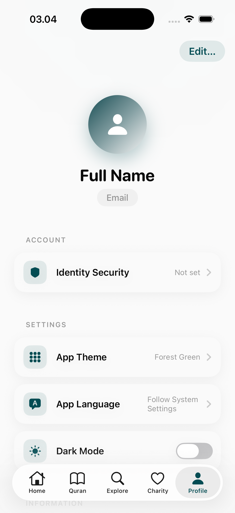
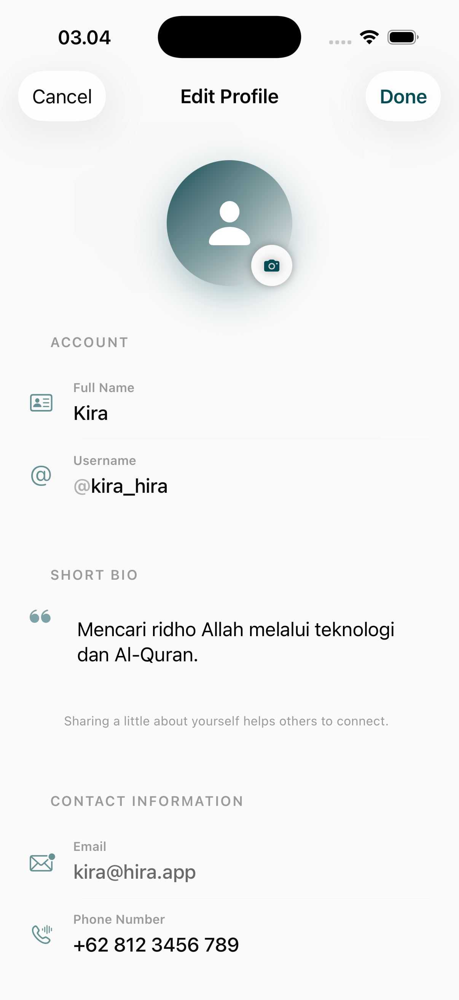
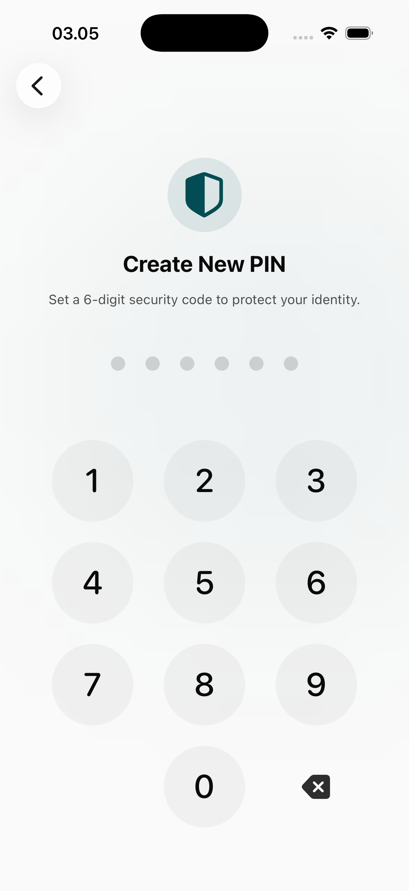
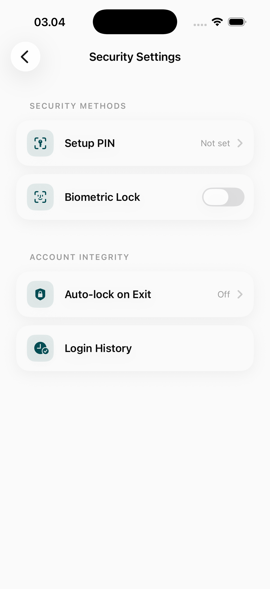
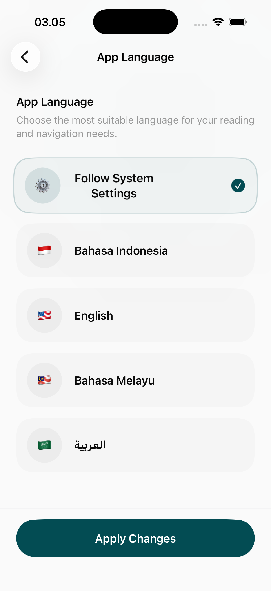
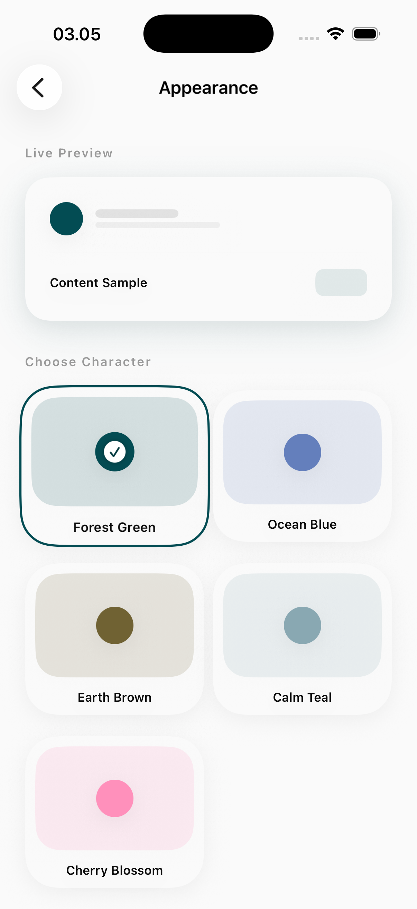
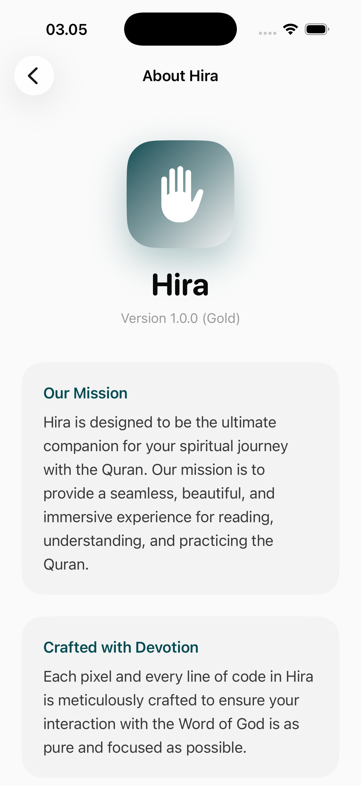
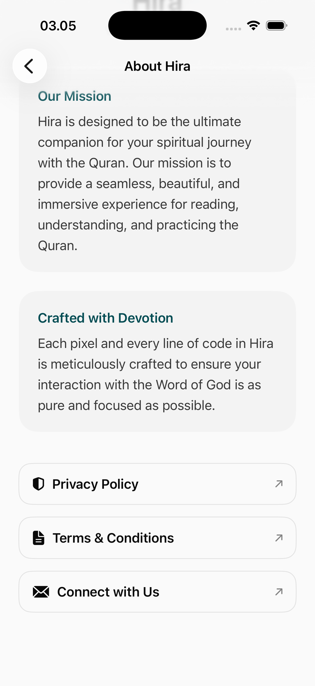

# Profile & Settings Page

The Profile and Settings module is the administrative hub for account management, security configuration, and application-wide personalization.

## User Account & Identity

### 1. Main Profile Dashboard
The entry point showing the user's current identity and status.
- **Account Summary**: Display of the user's name, profile image, and current spiritual level (linked to the Hijrah module).
- **Consolidated Progress**: Quick stats on Quran reading, total Tasbih counts, and days of consistency.

### 2. User Management
Flows for maintaining accurate account data.
- **Edit Profile**: Modify name, profile picture, and baseline personal information.

## Security & Privacy
Hira prioritizes the safety of the user's personal and spiritual data.
- **Create PIN**: Setup a secure PIN to lock specific app features or the entire application.
- **Identity & Security Management**: Controls for managing linked social accounts, session active devices, and data deletion (Right to be Forgotten).

## Application Customization
Tools to adapt the Hira experience to the user's specific environmental and linguistic needs.
- **App Language**: Select the primary interface language (e.g., Arabic, English, Indonesian).
- **Theming Module**: Comprehensive UI customization, including Light/Dark modes and specialized color tokens.

## Information & Support
- **App About & Versioning**: Detailed information on the current build version, developers, and the Hira mission.
- **Support Links**: Access to help centers, privacy policies, and terms of service.

## Design Focus
- **Admin Efficiency**: Logical grouping of complex settings to ensure the user never feels overwhelmed.
- **User Empowerment**: High level of control over data, security, and aesthetics.