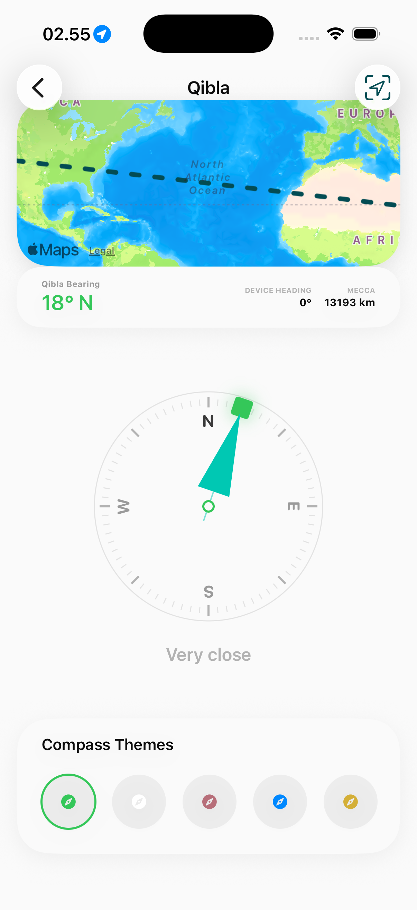
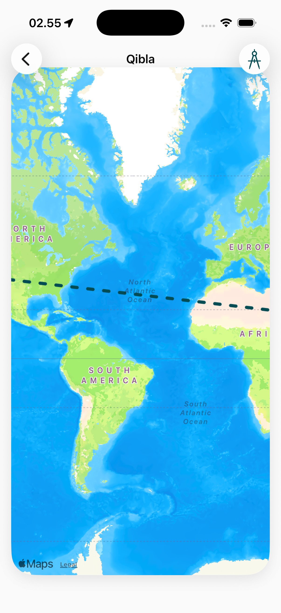

# Qibla Page

The Qibla module utilizes the device's hardware sensors and geographic data to provide precise direction towards the Kaaba in Makkah.

## Visual Modes

### 1. Compass View
The primary interface using AR or a 2D compass dial.
- **Directional Indicator**: Real-time feedback showing the angle towards the Qibla.
- **Calibration Support**: Prompts for sensor calibration to ensure maximum accuracy.
- **Visual Feedback**: Distinct indicators (e.g., color changes or haptic feedback) when the device is correctly aligned.

### 2. Map-Based Guidance (Extended)
A secondary view that plots the Qibla line over a global map.
- **Visual Validation**: Shows the direct geodesic path from the user's current location to the Kaaba.
- **Contextual Awareness**: Helps users understand their direction relative to local landmarks and geography.

## Technical Requirements
- **Sensors**: Requires Magnetometer (Digital Compass) and GPS access.
- **Reliability**: Implements automatic declination correction based on the user's location.