# Quran Page

The Quran module is the spiritual heart of the Hira application. It provides a world-class reading and listening experience, combining traditional Mushaf aesthetics with powerful modern search, study, and personalization tools.

## Main Navigation Views

### 1. Discovery & History
The initial screen serves as the launchpad for Quran study.
- **Search**: Global Quranic search for specific terms or verses.
- **Quick Links**: Jump to Surah, Juz, or specific Topics.
- **History & Daily Ayah**: Resume where you left off or reflect on the rotating daily verse.
<table>
  <tr>
    <td>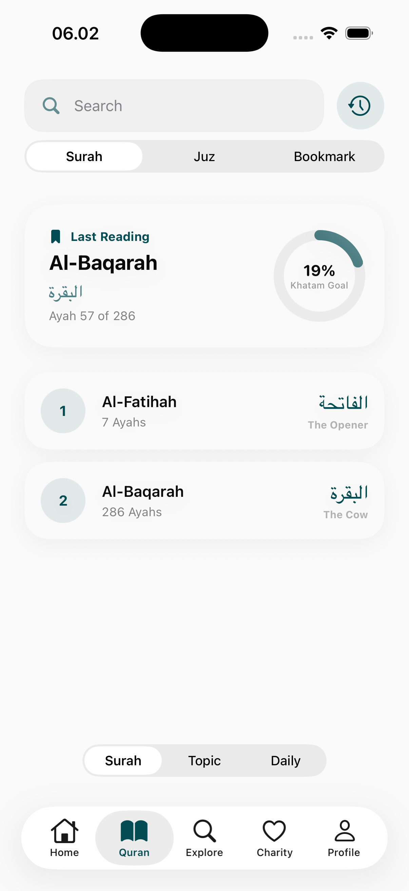</td>
    <td>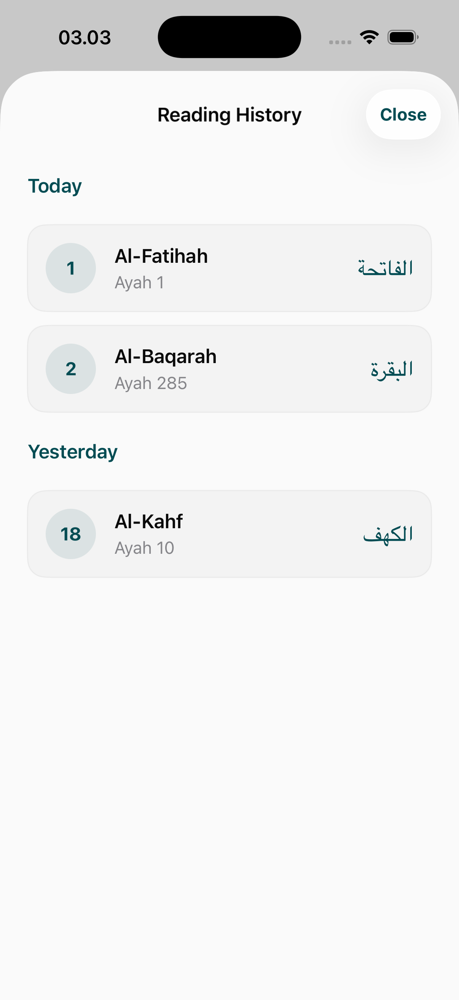</td>
    <td>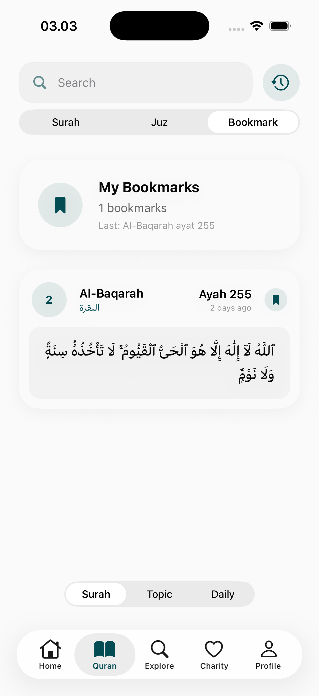</td>
  </tr>
</table>

### 2. Organizational Views
Users can navigate the Quran through traditional structures.
- **Surah List**: Categorized list of chapters with metadata (revelation place, total ayahs).
- **Juz View**: Navigation by the 30 standardized parts of the Quran.
- **Topic Search**: Search ayahs based on thematic categories (e.g., Patience, Faith).
<table>
  <tr>
    <td>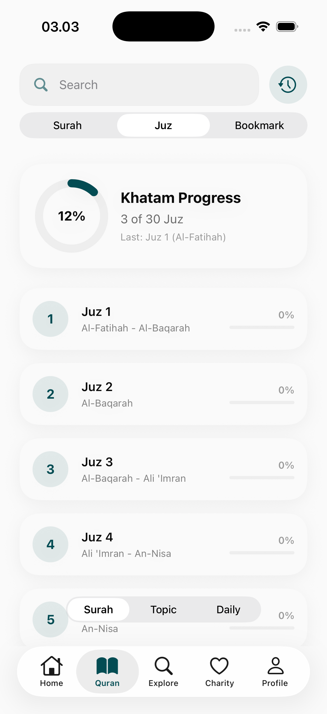</td>
    <td>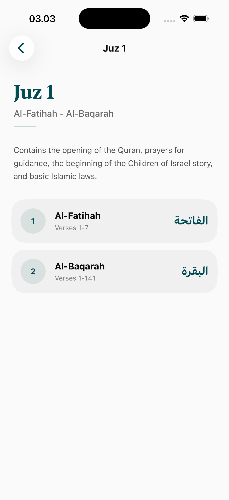</td>
    <td>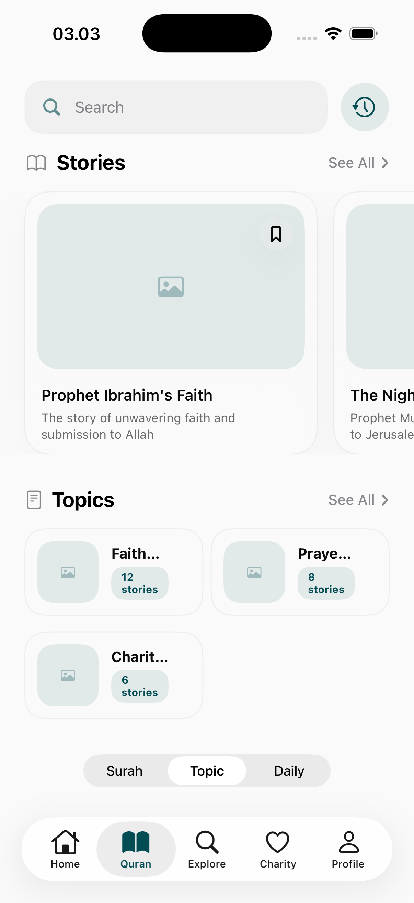</td>
  </tr>
</table>

## Reading & Study Experience

### 1. Verse-by-Verse (Detail View)
A structured reading view focused on study and deep contemplation.
- **Arabic Text**: High-resolution script with Tajweed color coding.
- **Interlinear Information**: Clear display of translations and tafsir.
- **Ayah Options**: Long-press or tap to access copying, sharing, or detailed word-by-word analysis.
<table>
  <tr>
    <td>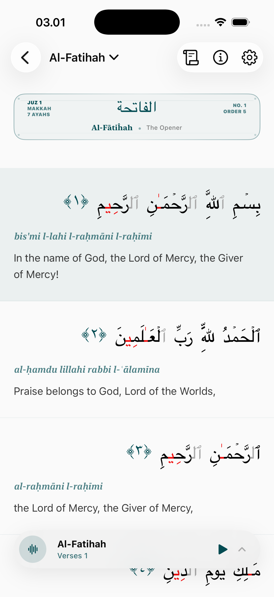</td>
    <td>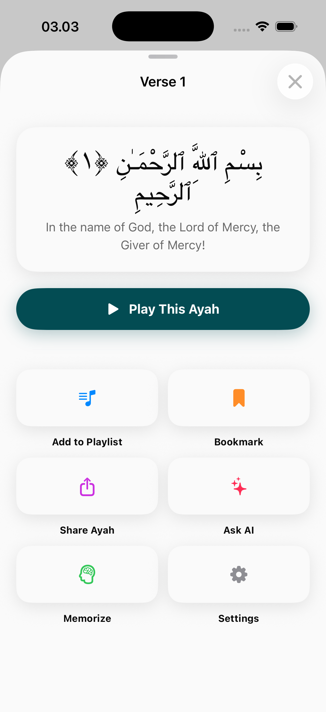</td>
  </tr>
</table>

### 2. Traditional Mushaf View
For users who prefer the traditional page-by-page reading experience.
- **Page Layout**: Digitized pages mirroring the physical Madinah Mushaf.
- **Navigation**: Seamless page-turning gestures and jump-to-page functionality.
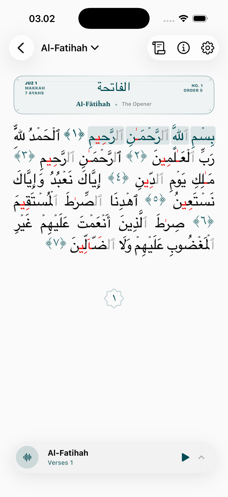

## Personalization & Tools

### 1. Audio & Recitation
A comprehensive audio suite for listening and memorization.
- **Reciter Selection**: Choose from various world-renowned reciters.
- **Audio Controls**: Detailed playbacks, loop cycles for memorization, and background playback support.
<table>
  <tr>
    <td>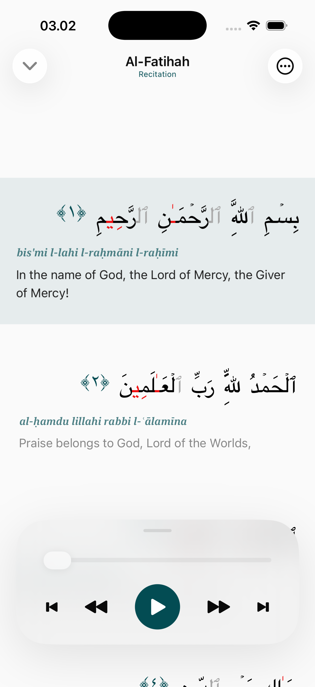</td>
    <td>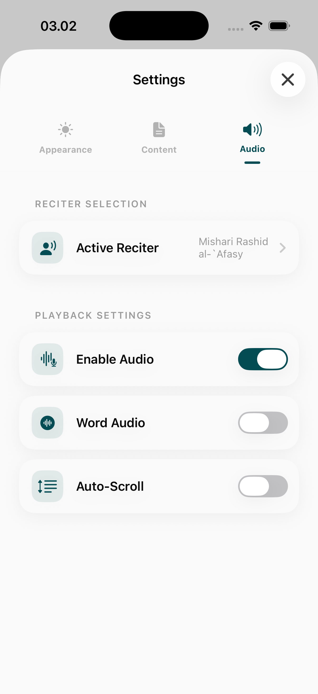</td>
    <td>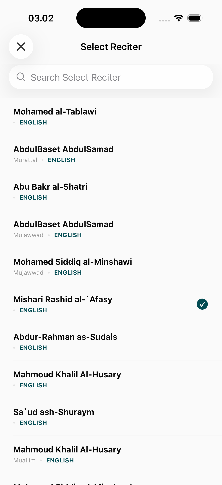</td>
  </tr>
</table>

### 2. Reading Preferences (Appearance)
Highly customizable UI to ensure a comfortable reading experience for all ages and vision needs.
- **Font Settings**: Adjust Arabic and translation font sizes and styles.
- **Theme Selection**: Dark mode, light mode, and Sepia patterns for long reading sessions.
<table>
  <tr>
    <td>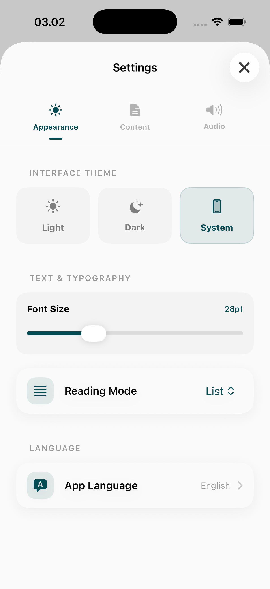</td>
    <td></td>
  </tr>
</table>

### 3. Study Resources (Content)
Standardized access to external scholarship.
- **Translation Management**: Toggle and download various language translations.
- **Tafsir Integrated**: Select from multiple classical and modern exegeses.
<table>
  <tr>
    <td>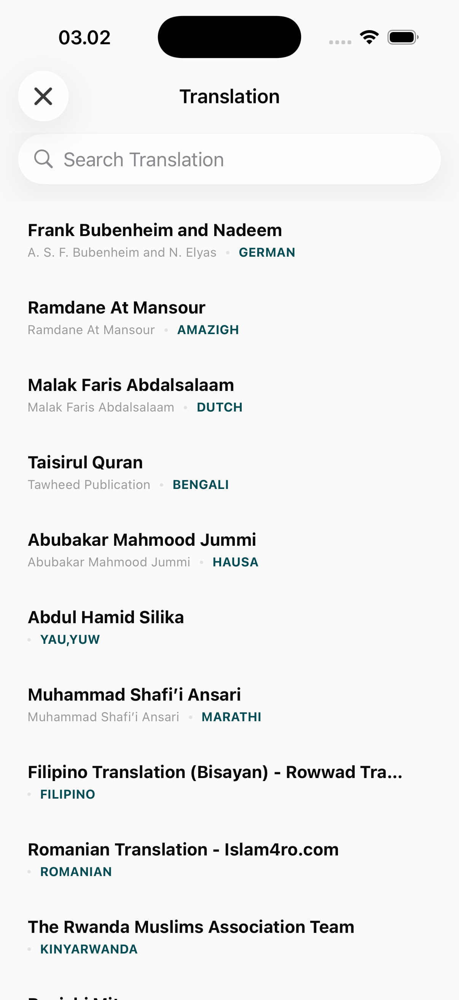</td>
    <td>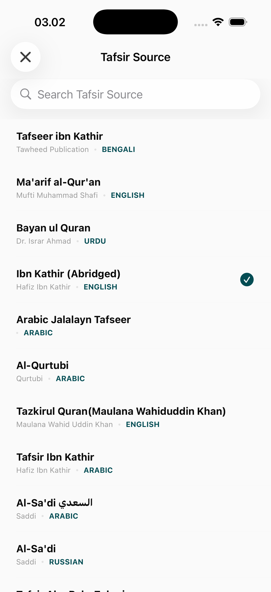</td>
    <td>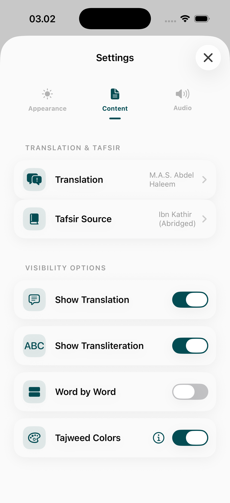</td>
  </tr>
</table>

## Utility Features
- **Surah Information**: Historical background and thematic summaries for each chapter.
- **Selection Menus**: Fast, bottom-sheet driven navigation for switching ayahs and surahs.
<table>
  <tr>
    <td>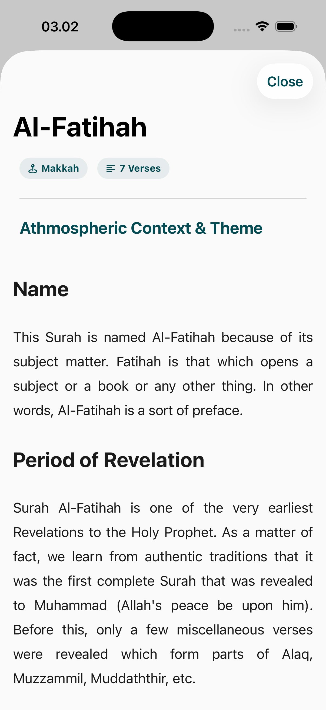</td>
    <td>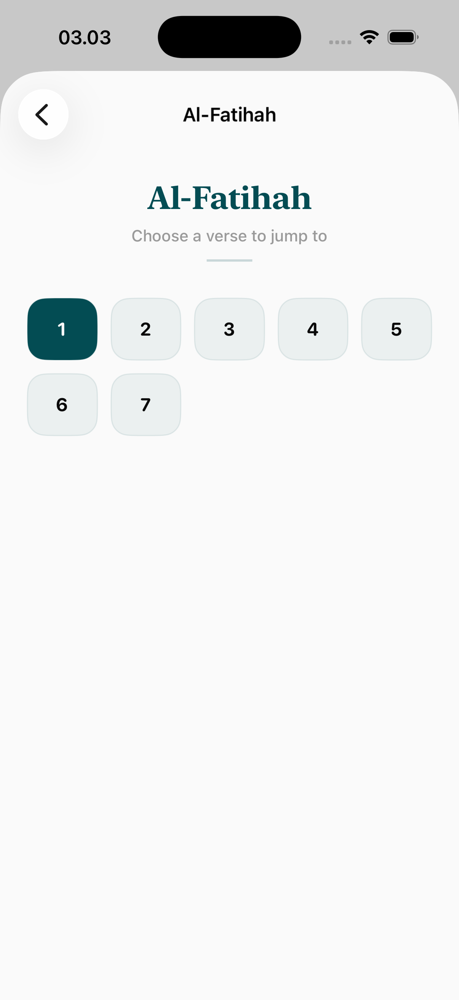</td>
    <td>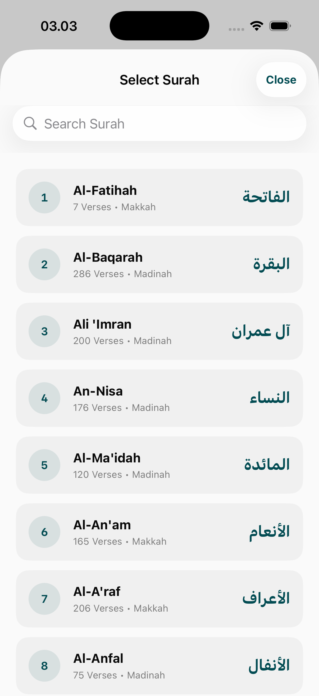</td>
  </tr>
</table>
