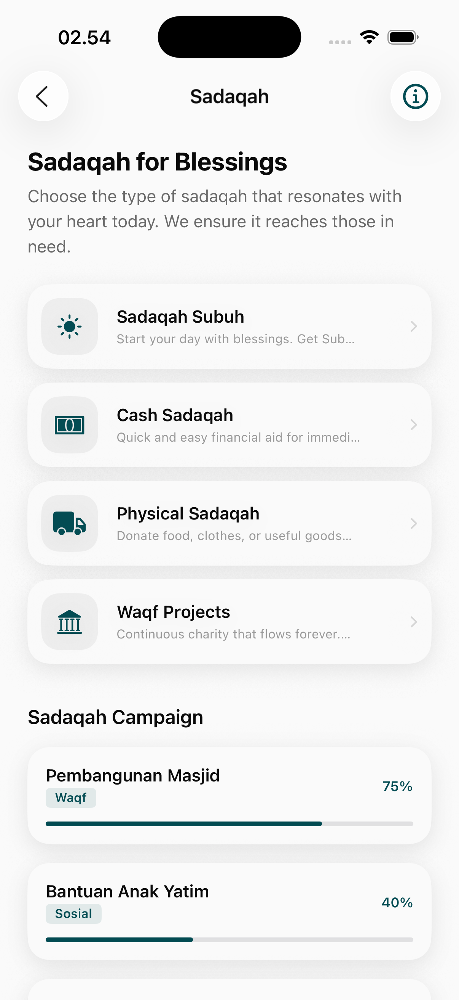
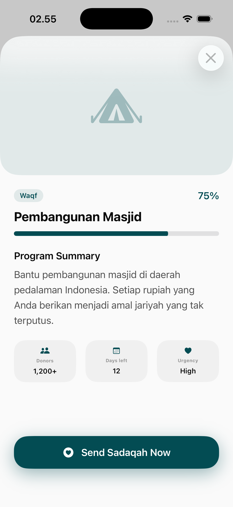
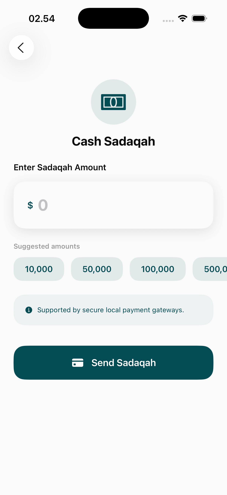
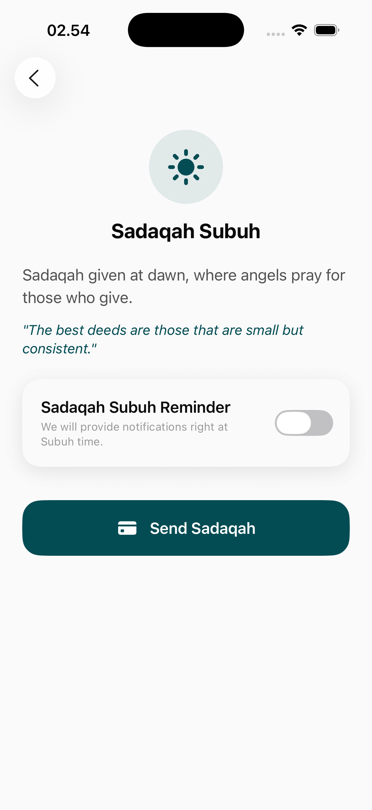
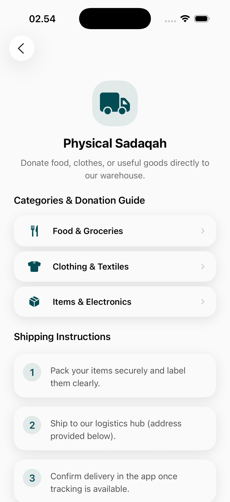
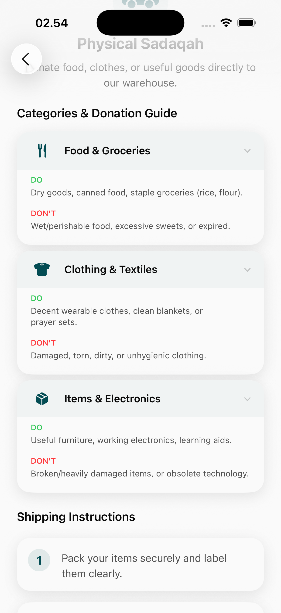
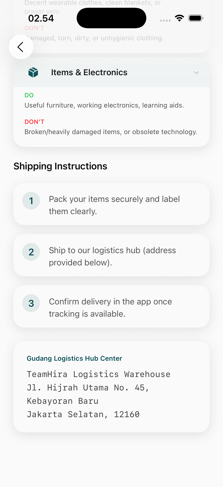
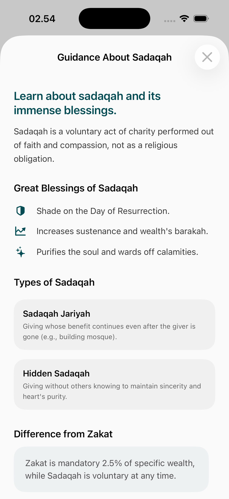
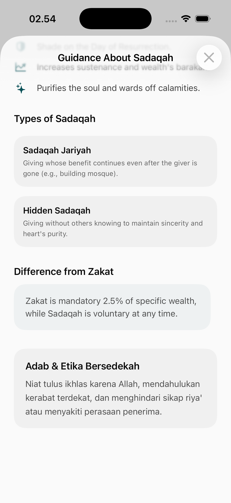

# Sadaqah Page

The Sadaqah module facilitates voluntary charity by providing users with diverse ways to give, ranging from localized physical donations to global cash campaigns.

## Ways to Give

### 1. Main Sadaqah Interface
The central hub for all voluntary giving options.
- **Service Selection**: Choose between digital giving (Cash) or logistics-based giving (Physical).
- **Featured Campaigns**: High-impact campaigns pinned for immediate attention.

### 2. Digital Giving (Cash Sadaqah)
A streamlined flow for monetary donations.
- **Categorized Campaigns**: Themed donations (e.g., Education, Healthcare, Disaster Relief).
- **Subh Sadaqah**: Specialized morning charity reminders and quick-give options.

### 3. Physical Sadaqah
A unique feature that facilitates the donation of physical goods.
- **Donation Flow**: Step-by-step guidance on how to package and send physical goods.
- **Item Categorization**: Identify the types of goods accepted (e.g., Clothing, Books, Food).
- **Logistics Integration**: Information on collection points or shipping methods.

## Educational Resources
Detailed information about the spiritual benefits and ethics of giving.
- **Adab of Giving**: Guidelines on maintaining sincerity and respect.
- **Impact Tracking**: Information on how donations are utilized.

## User Experience Design
- **Frictionless Giving**: One-tap donation options for recurring habits like Subh Sadaqah.
- **Transparency**: Clear information on the destination and intent of each campaign.