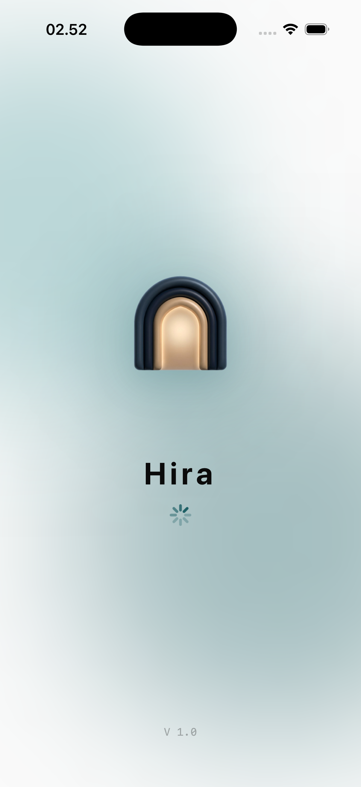

# Splash & Launch Page

The splash and launch screens provide the initial visual identity during application startup and data synchronization.

## Loading Sequence

### 1. Launch Screen
The initial static image displayed by the OS while the binary is being loaded into memory. It features the Hira brand logo on a branded background to maintain continuity.

### 2. Main Splash Screen
The interactive or animated loading screen that appears while the app initializes internal services and fetches initial data (e.g., prayer times, user profile). It emphasizes the Hira brand identity and creates a smooth transition into the user experience.

