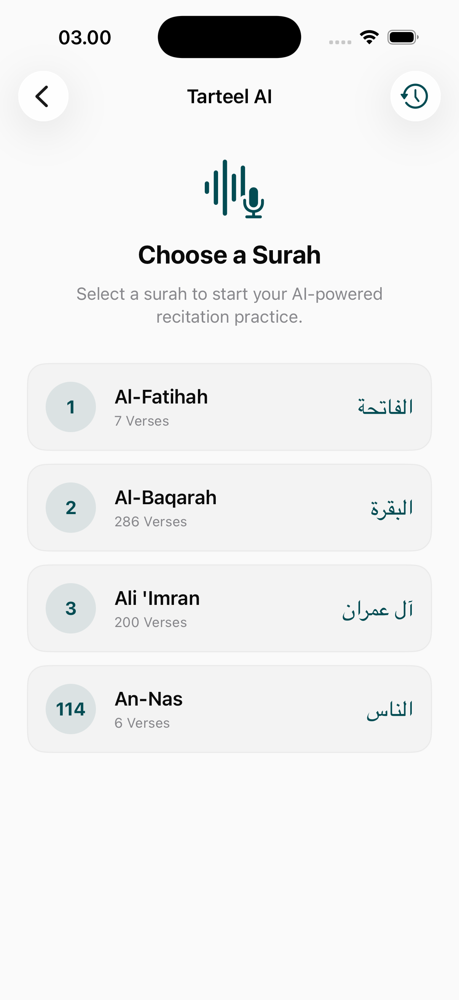
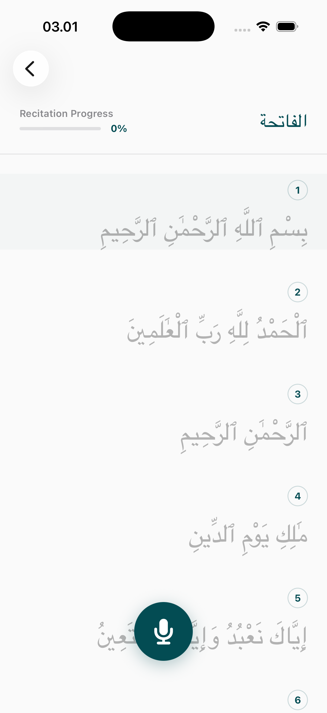
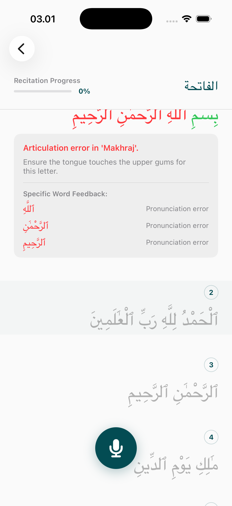
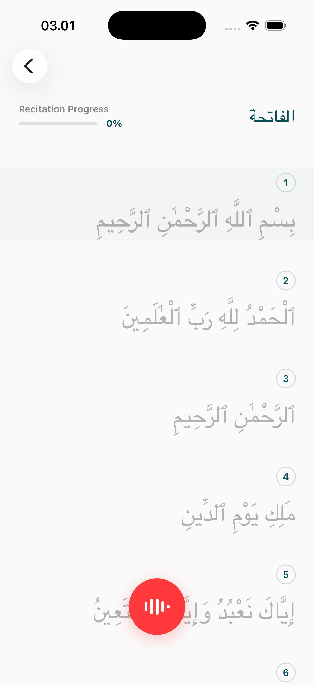

# Tarteel Page

The Tarteel module utilizes advanced audio analysis or recitation guidance to help users perfect their Quranic pronunciation and rhythmic recitation.

## Interface Breakdown

### 1. Tarteel Discovery
The main entry point for the Tarteel experience.
- **Featured Contests/Challenges**: Gamified recitation goals to encourage user participation.
- **Library Access**: Navigate through available surahs and lessons optimized for Tarteel.

### 2. Recitation Detail & Guidance
The core focused-mode for active recitation.
- **Guided Playback**: Integrated audio to demonstrate proper Tarteel recitation.
- **Toggle Guidance**: Users can switch visual guidance or audio overlays on and off to test their proficiency.
- **Real-time Feedback**: Visual indicators (where applicable) that respond to the user's recitation progress.

## Educational Focus
- **Pronunciation Accuracy**: Focused on the nuances of Tajweed and Tarteel.
- **Self-Assessment**: The toggleable guidance allows users to transition from guided learning to independent recitation.