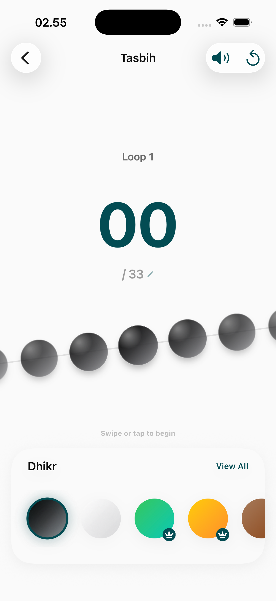
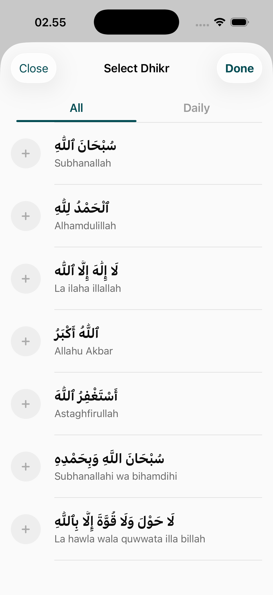
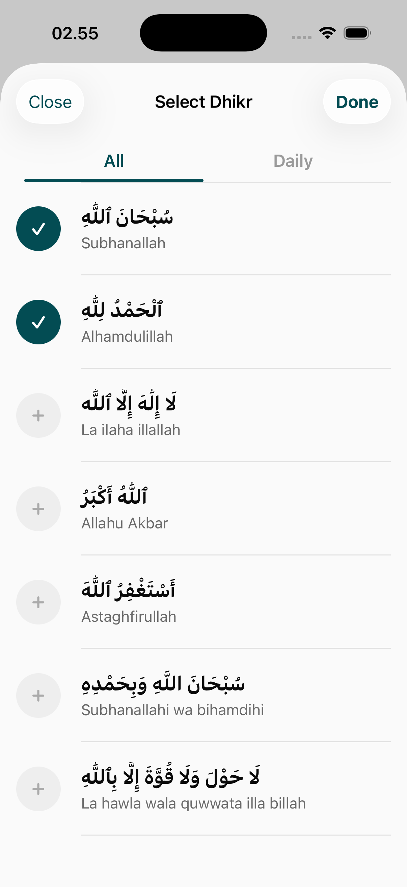
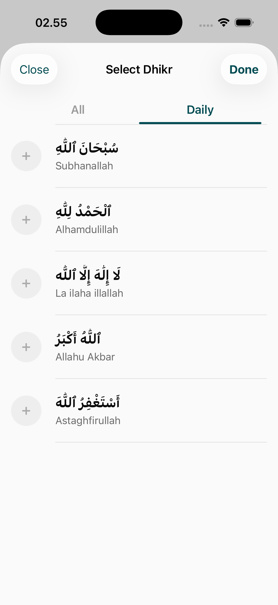
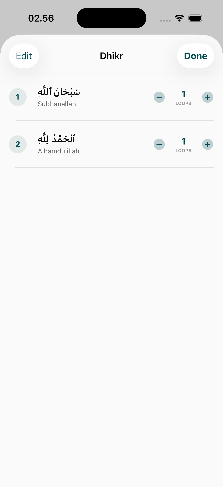
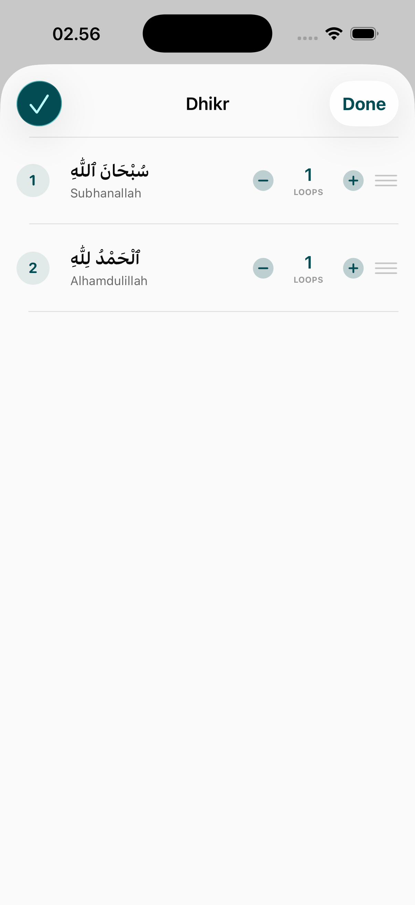
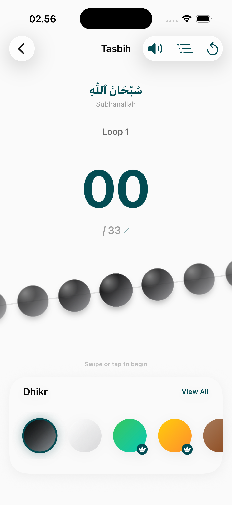
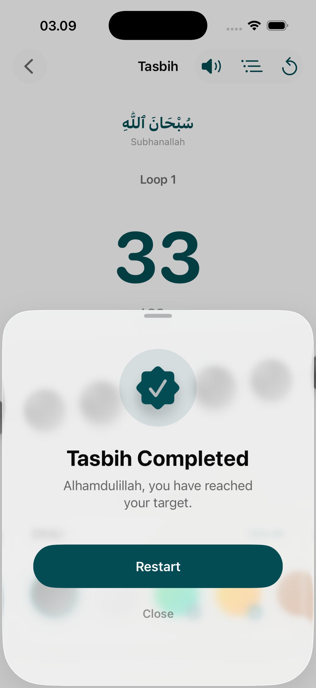

# Tasbih Page

The Tasbih module is a digital Dhikr companion designed to help users maintain their daily remembrance of Allah through customizable counters and standardized goal tracking.

## Core Features

### 1. Digital Counter
A clean, focused interface for active Dhikr.
- **Large Interaction Area**: The entire screen serves as a touch surface for increments.
- **Haptic Feedback**: Subtle vibrations for each count to allow for focused recitation without looking at the device.
- **Visual Progress**: Real-time counter display with quick reset and session save options.

### 2. Dhikr Collections & Goals
A management interface for various types of Dhikr.
- **Pre-defined Lists**: Standardized recitations (e.g., Subhanallah, Alhamdullilah, Allahu Akbar) with recommended counts.
- **Daily Targets**: Visual checklists to monitor completion of daily spiritual goals.
<table>
  <tr>
    <td></td>
    <td></td>
    <td></td>
  </tr>
</table>

### 3. Customization & Editing
Users can personalize their Dhikr experience to match their specific rituals.
- **List Management**: Add custom Dhikr phrases and set unique target counts.
- **Reordering & Editing**: Drag-and-drop sorting to prioritize specific recitations.
<table>
  <tr>
    <td></td>
    <td></td>
  </tr>
</table>

## Interaction Flows & Feedback
- **Active State**: Visual indicators show which Dhikr is currently being tracked.
- **Success States**: Celebratory UI animations and feedback upon reaching a goal.
- **Integrated Counters**: Seamlessly switch between different Dhikr in a session while maintaining cumulative progress.
<table>
  <tr>
    <td></td>
    <td></td>
  </tr>
</table>

## Design Details
- **Focus Mode**: Minimum UI clutter in the active counter view.
- **Feedback Loops**: Constant haptic and visual updates to ensure the user feels progress.