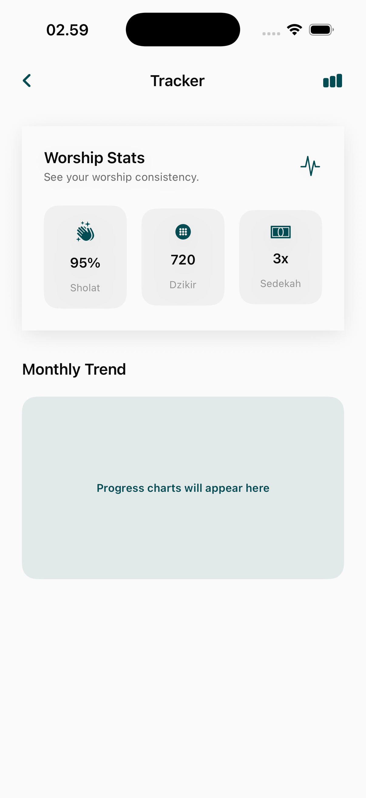

# Tracker Page

The Tracker module provides localized, data-driven visualization of the user's daily religious commitments, including prayer consistency and Dhikr habits.

## Core Features

### 1. Unified Activity Analytics
A comprehensive dashboard that aggregates spiritual data into actionable insights.
- **Heatmaps & Trends**: Visual representation of "Streaks" or frequency of activities over weeks and months.
- **Daily Checklists**: Integration with prayer times and Tasbih modules to automatically mark rituals as complete.
- **Progressive Goals**: Comparisons between the user's current activity and their set spiritual targets.

## User Experience Design
- **Objective Feedback**: Helps users identify their own patterns of consistency and areas for improvement.
- **Motivation through Data**: Celebrates long streaks and encourages returning to habits after a break.
- **Automatic SyncING**: Reduces manual input by pulling data from other active modules (e.g., Qibla, Quran, Prayer Times).