# Zakat Page

The Zakat module provides a comprehensive suite of calculators and educational resources to help users fulfill their third pillar of Islam with precision and ease. It covers all major types of wealth subject to Zakat.

## Dashboard & Education

### 1. Zakat Dashboard
The main entry point provides an overview of available calculators.
- **Categorized Calculators**: Quick access to specific wealth types (e.g., Gold, Profession, Savings).
- **Recent Calculations**: Ability to resume or view previous calculations.
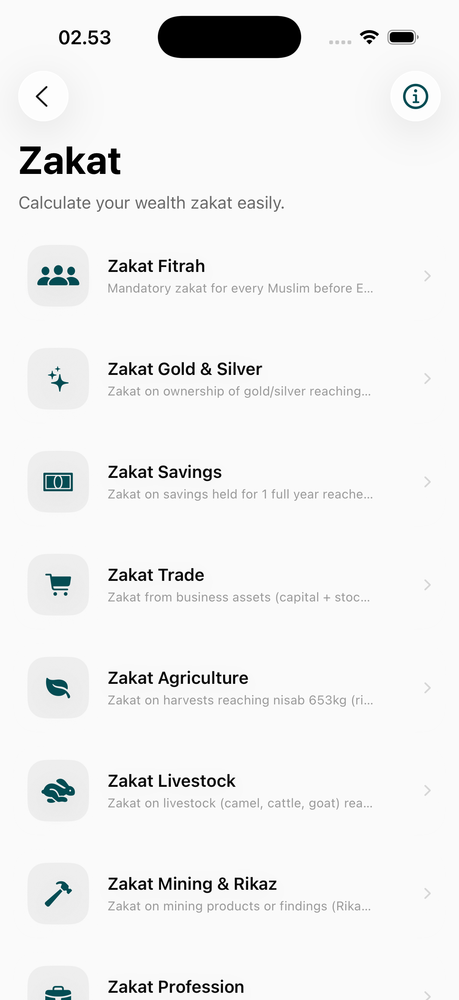
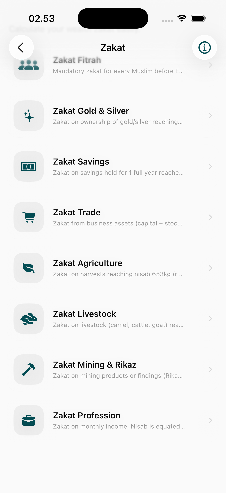

### 2. Educational Resources (Zakat Info)
Detailed explanations of Zakat principles, Nisab (thresholds), and Haul (duration).
- **Comprehensive Guides**: Explains the "Why" and "How" of each Zakat type.
- **Standard Guidelines**: References common scholarly opinions on calculations.
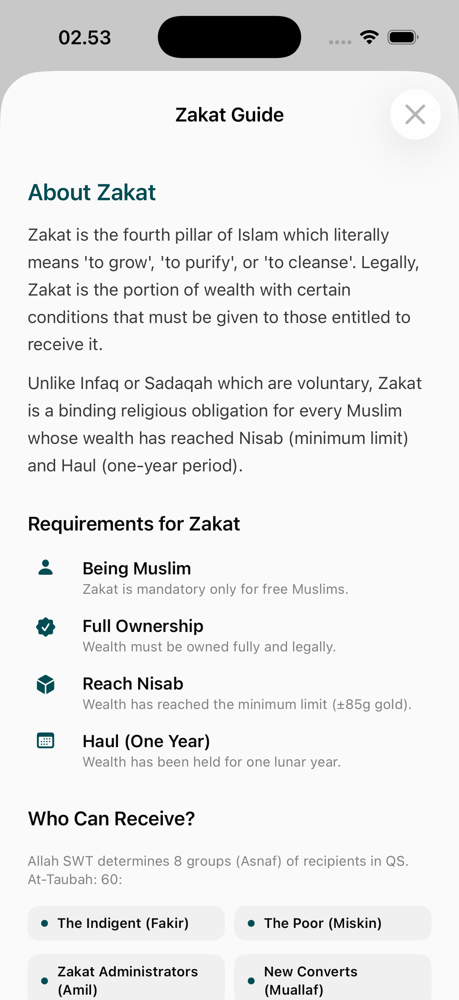
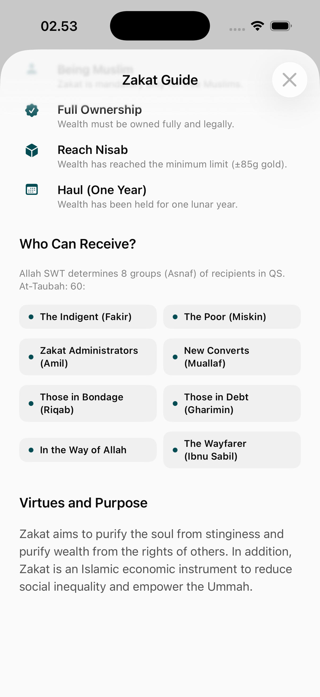

## Specialized Calculators

### 1. Personal Wealth & Income
Calculators for daily financial assets.
- **Zakat Profession**: For monthly or annual salary and professional income.
- **Zakat Savings**: For cash holdings, bank balances, and easily liquidated assets.
- **Zakat Gold & Silver**: Based on weight and current market value for personal jewelry or investments.
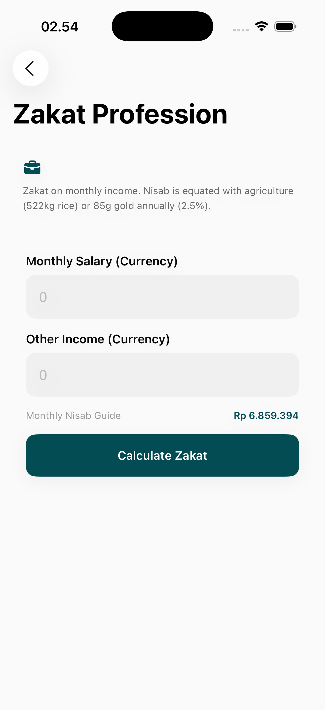
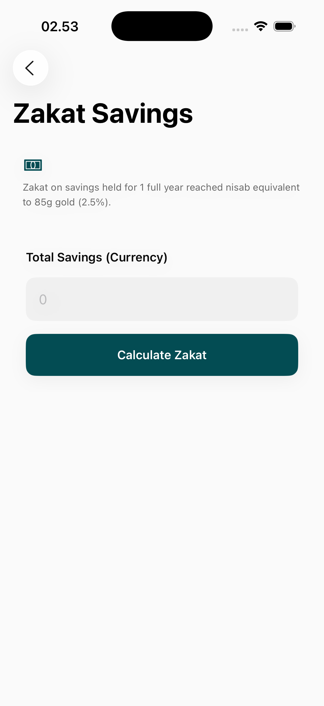
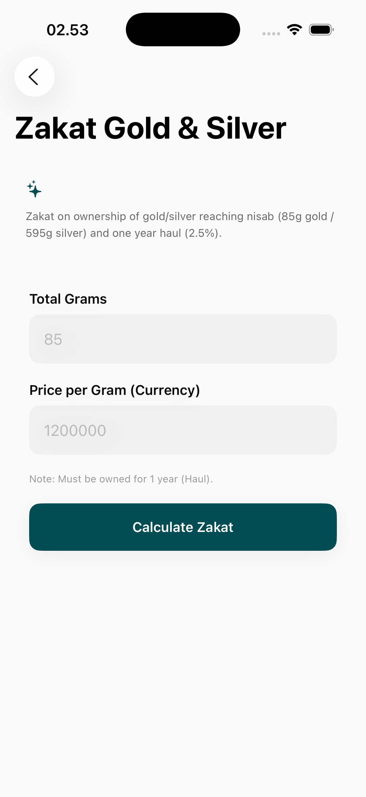

### 2. Business & Agriculture
For entrepreneurs and primary producers.
- **Zakat Trade**: For business inventory and commercial assets.
- **Zakat Agriculture**: Specifically for crops and produce, with toggles for irrigation methods (affects the percentage).
- **Zakat Livestock**: For cattle, sheep, goats, and camels.
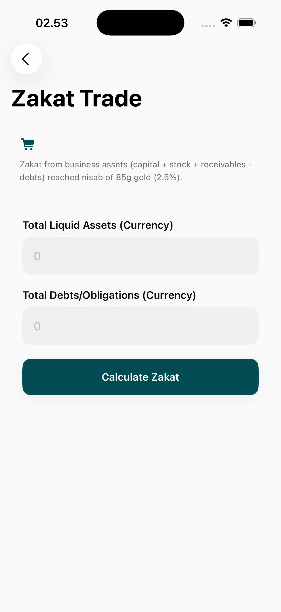
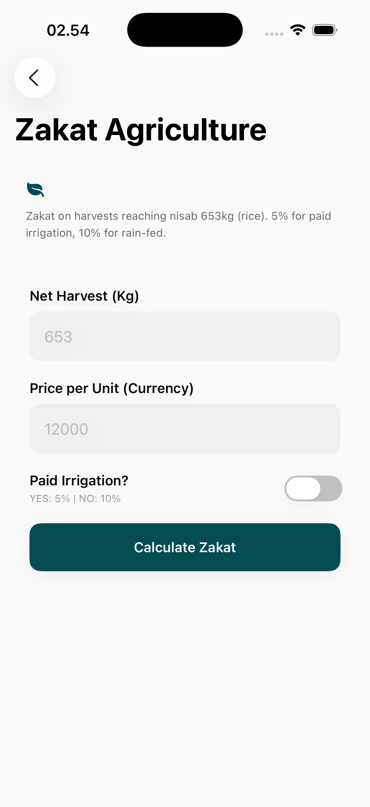
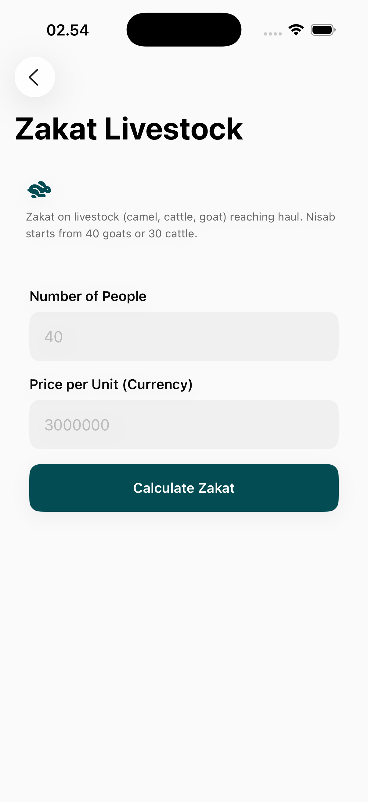

### 3. Specialized Assets
Calculators for unique or infrequent wealth types.
- **Zakat Mining & Rikaz**: For minerals and found treasures.
- **Zakat Fitrah**: A simplified calculator for the mandatory end-of-Ramadan charity, often based on household members.
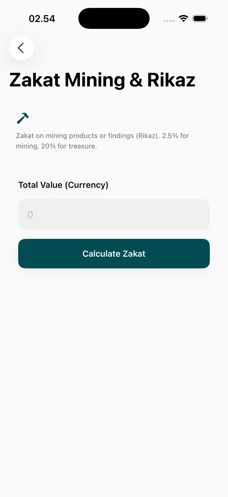
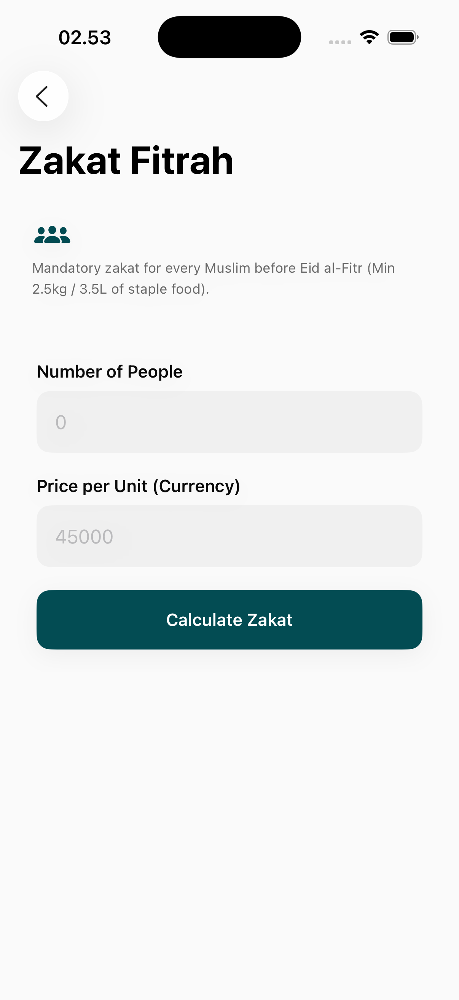

## Core Calculation Logic
- **Nisab Tracking**: Automatically checks if the entered amount meets the current threshold.
- **Haul Validation**: Reminds users of the one-year holding period requirement where applicable.
- **Dynamic Updates**: Interface updates in real-time as users enter their asset details.